# FIT5046 Android 初笔记

## Unit intro

### 1. Unit schedule

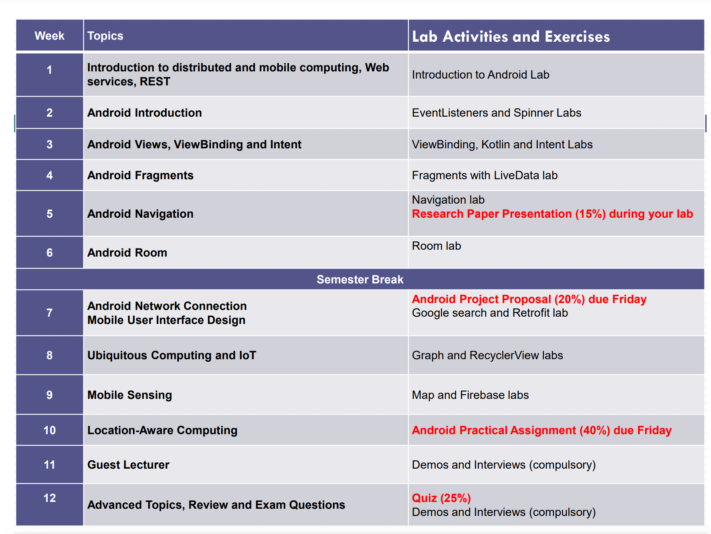


### 2. Teaching methods

1. Lecture(2h) 
2. Lab(2h)


### 3. Assessment

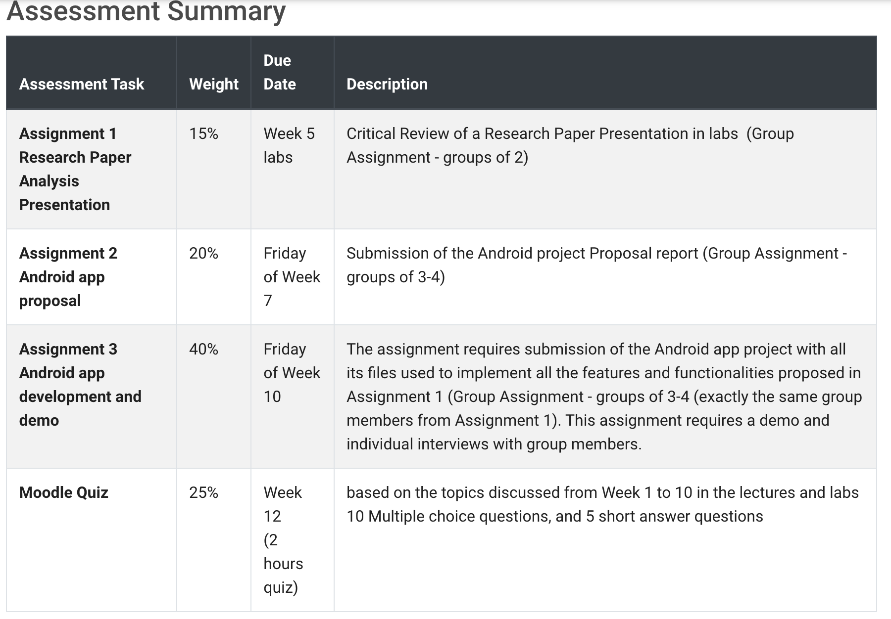


### 4.Learning Resource

1. FIT2081我安卓笔记
2. ppt


## Week01:Intro to Distributed computing

### 1.Distributed Computing

`Distributed Computing`

a number of autonomous entities which are geographically distributed can **communicate and exchange messages through a computer network** to achieve certain related tasks

从这请求服务，从那请求服务


`Vertical and Horizontal Distribution`

- *Vertical distribution*: placing logically different layers/components on different machines

   **Each layer on one single machine，connect each other**一对一

   Eg. 手机->router->network

-  *Horizontal distribution*: a single logical layer/component is

  distributed **across multiple machines** to improve scalability  一对多
  
  Eg.  distributing a database on multiple machines 

- 实际应用场景下经常是两种分布相结合

  - 水平分布的S/C布局(客户端->多个服务器)

  - server 端又可以垂直发布(游戏登录->微信授权中间件->数据库)


`Mobile computing` is associated with mobility of hardware, users, data, applications and network. 因为wireless技术（wifi，5G，NFC）


`Mobile and Distributed Computing`

定义：<font color="red">It integrates mobile and wireless devices into distributed systems</font>

eg. Wireless sensors, wearables, smartwatches, smartphones, tables, and smart things (e.g. smart refrigerator)


`Distributed Computing Models`

client/server model

-  Server processes offer services to clients processes
- Usually there is a data storage at the backend


`SOA (Service-Oriented Architecture)`

Application functionalities (software components) are provided as **services** (independent modules)

**RESTful web services**  provide a standard interface(API) to make the functionalities(services) available to the public (clients)


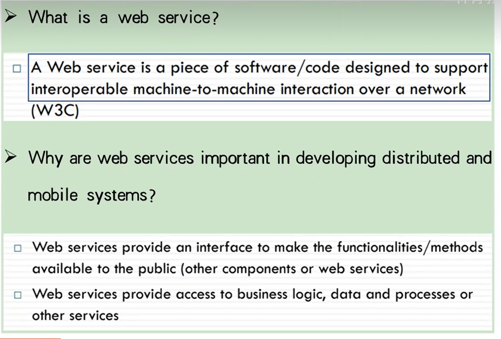

web service的开发=APIs的开发


### 2.REST

作用：请求后端api

REST is not a protocol. It is an architecture. it uses standards:

- HTTP
- URL
- XML/HTML/JSON/etc
- MIMETypesorMediatypessuchastext/xml,image/gif, application/json, audio/mpeg


`resource`:Any information that can be named can be a resource

`resource identifier`:Each resource becomes accessible via a URI/URL

A resource can have different `representations格式 `(e.g. JSON or XML or html)

`REST`each resource state has a representation, and this representation can be updated and transferred from the server to the client application


`Architectural Constraints`

- Client/Server:

  separates the user interface concerns of clients from the data

  storage concerns of servers. simplifying the server components (not concerned about the user interface)

-  Stateless

  each request from the client to the server must contain all

  the information necessary to understand the request

- Cache

  If a response is cacheable, the response can be reused for equivalent requests later

- Uniform Interface

  all resources are accessed with a generic interface (e.g., HTTP GET, POST, PUT, DELETE)

- Layered Systems

  allows an architecture to be composed of hierarchical layers

  Clients have no knowledge that services they invoke may also invoke other services

- Code-On-Demand

  allows client functionality to be extended by downloading and executing code


### 3.JSON

定义：api的数据格式

parsing online:http://json.parser.online.fr/

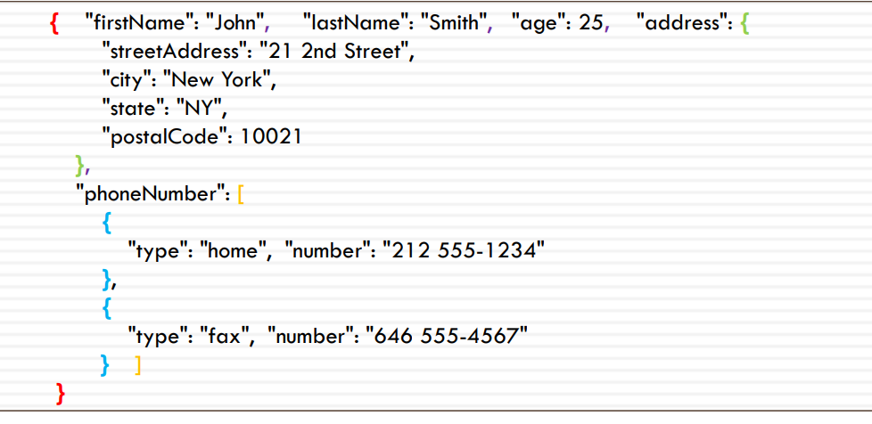

In Android, we will use org.json libraries

```java
import org.json.JSONObject;

JSONObject jsonObject = new JSONObject(result); 
JSONArray jsonArray = jsonObject.getJSONArray("items"); 
if(jsonArray != null && jsonArray.length() > 0) {
	snippet =jsonArray.getJSONObject(0).getString("snippet"); 
}
```


### 4.Tutorial

#### 1.下载

https://developer.android.com/studio

1.下载Android Studio（建议Mac电脑开发）

Device Manager->create device

运行测试


2.Logcat查看错误信息，警告信息，debug信息


3.Debug测试

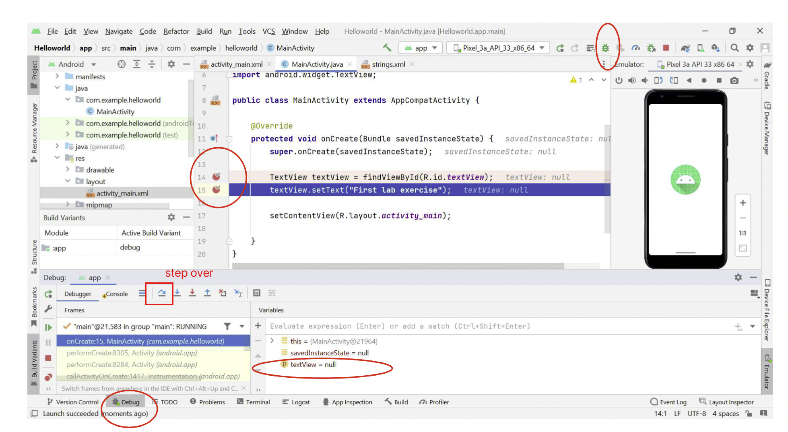

4.Using Lint

定义：Lint is a scanning tool provided by Android Studio to **check** your code and provide messages/warnings for potential bugs or **optimize** your code

From the top menu, select Code > Inspect Code (uncheck Include test sources).


#### 2.文件结构

`res文件夹`

- drawable: put all images

- layout: xml files,define UI 

- values: 

  - **colors.xml**: define all needed colors,global access + create night mode file	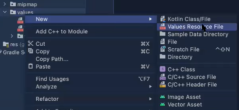

  - **strings.xml**

    定义app名字

> Define different languages

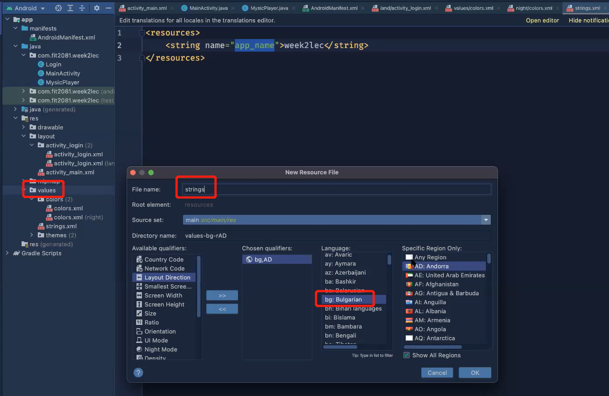


#### 3.基础知识

`Components`

**Activities**: UI and logic of a single window in the UI

**Services**: run in the background(different thread) and don't have a UI	  

Use it when an app need continue running tasks but no need UI

**Content Providers**: An app share its data to another app through it

**Broadcast receivers**: apps can respond to Broadcast intents 

launch a service,make data update,issue notification


`Constraints`

**Fixed Constraints**: You specify a specific and fixed dimension by telling width and height

**Wrap Content**: The view expands only as much as needed to fit its contents.

**Match Constraints**: The view expands as much as possible to meet the constraints we defined on each side 

经验: match我们可以充满，wrap微调


`Activity Intents`

 launch(Navigate to) another activity or service

1. UI上面定义一个button

2. UI定义事件名字
3. java里面写事件方法

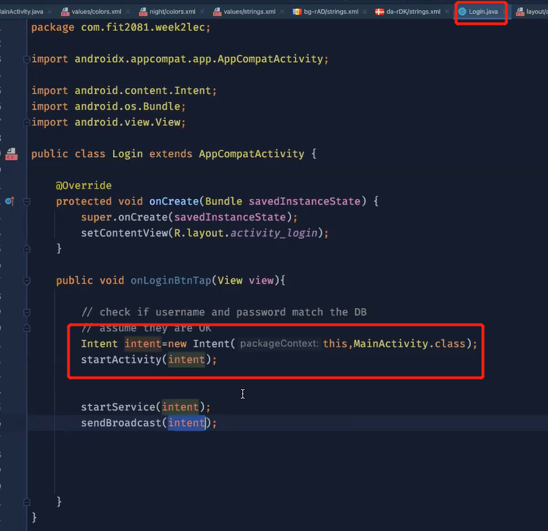

>点击事件

- 方法1

```xml
<?xml version="1.0" encoding="utf-8"?>
<Button xmlns:android="http://schemas.android.com/apk/res/android"
    android:id="@+id/button_send"
    android:layout_width="wrap_content"
    android:layout_height="wrap_content"
    android:text="@string/button_send"
    android:onClick="sendMessage" />
```

```java
/** Called when the user touches the button */
public void sendMessage(View view) {
    // Do something in response to button click
}
```

- 方法2

```java
Button button = (Button) findViewById(R.id.button_send);
button.setOnClickListener(new View.OnClickListener() {
    public void onClick(View v) {
        // Do something in response to button click
    }
});
```


> 收集user input的数据并且弹出框

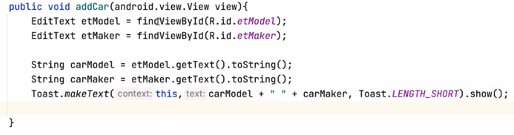


## Week02:Intro to Android

### 1.5 types of Mobile apps

`1.Native App`

Written in a native language like Android or Swift, so compiled  into the machine code

| 优点                                                         | 缺点                                                         |
| ------------------------------------------------------------ | ------------------------------------------------------------ |
| 1. High performance   2. Provides full access to all the features and hardware of the  device     3. Offline operation capability    4.Built-in security layers | 1. Distributed through native app stores (Apple App Store or  Google Play) and requires installation on the device     2.not cross-platform |


`2.Web apps`

 Web Apps are usually built with HTML, CSS and JavaScript

| 优点                                                         | 缺点                                                         |
| ------------------------------------------------------------ | ------------------------------------------------------------ |
| 1.No need to download and install the app   2.Cross-platform,Run in the web browser of the device like a web page | 1.The lack of access to hardware features (e.g. sensors or camera)   2.Low performance (in terms of speed and responsiveness) |


`3.Hybrid apps`

Combining the benefits of both web technologies like HTML, CSS, and  JavaScript and native apps’ features/capabilities

| 优点                                                         | 缺点 |
| ------------------------------------------------------------ | ---- |
| 1.High quality and flexible UIs   2.Developed for different app platforms from a single codebase   3.native apps have better performance, offer more functionalities  (interacting directly with OS), and their size is smaller |      |

Example: React Native , Ionic


`4.Progressive Web App (PWA)`

to extend the capabilities of hybrid apps

-  Installed directly from the webs

- Provide an offline experience
- PWA’s key components: Service Workers (enable offline operation, push new contents, and  notifications)


`5.Flutter`

For building multi-platform applications from a single codebase

- Fast performance 
- Offers automated testing and developer tooling 
-  Supports different screen sizes


### 2.Android

**IDE**:  Android Studio

Android **API** Versions:  Android 13 API 33

Android **emulator**

**Gradle**-based build system to configure and manage building projects. Flexible and easy to include libraries (local and remote)


**Jetpack**: includes a large group of libraries for developing high  quality apps. available  through including the Google Maven repository


Java-> Activities: What the app will do

XML->layout,views: How the app will look like


#### 1.Layouts 

定义： A `layout` defines the **structure** for a user interface of the app. e.g.  LinearLayout, ConstraintLayout, or RelativeLayout

 These different layout classes extend ViewGroup, which is like an invisible  container that can contain other views

A `View` is the basic **class** for widgets (UI components). widgets e.g. a Button or a TextField


`Layout types`

1. RelativeLayout and Linear layouts (Vertical or HorizontaI)


2. ConstraintLayout

定义： default layout.  It requires adding constraints to define the  positon of a view.  At least one horizontal and one vertical  constraint for the view


#### 2.Android Project Files

`AndroidManifest.xml`

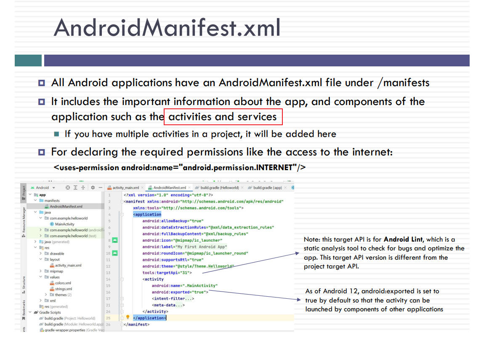

`Gradle files`

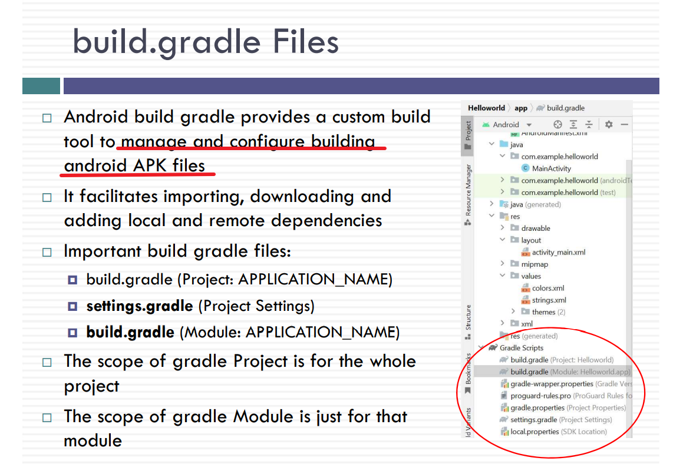

Gradle files enable you to easily import and use remote repositories

By default, Android repositories include Google s Maven repository, and the
Maven central repository

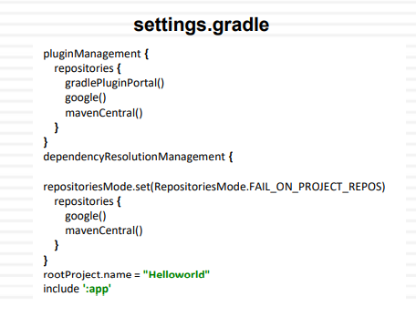

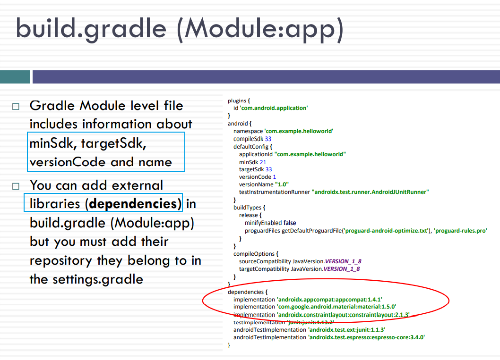


`res/values/strings.xml`

You can declare and include **String variables** in this file

It is easier to find and update text in a single location

java code

```java
String message = getString(R.string.edit message);
```

xml

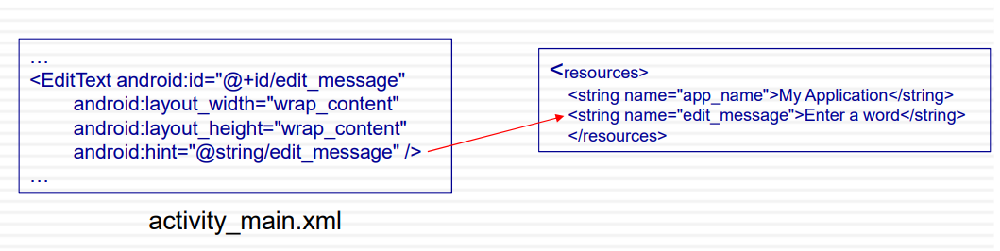


`activity_main.xml`

controls the entire project’s UI


`MainActivity.java`

MainActivity.java defines how the  application will behave and interact  with the user

```java
//setContentView() method loads and inflates the XML layout file that passed to it as an argument and create a view hierarchy tree
setContentView(R.layout.activity_main);
```

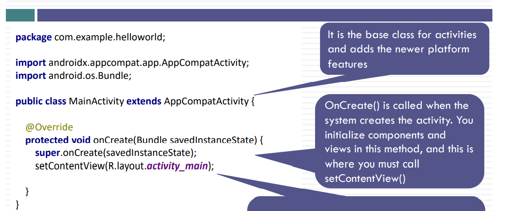


**id**:reference a view by id

```java
//android:id="@+id/textView"
TextView textView = findViewById(R.id.textView);
textView.setText("First lab exercise");

//or using View binding
binding.editText.setText(“Hello");
```


#### 3.Activity Lifecycle

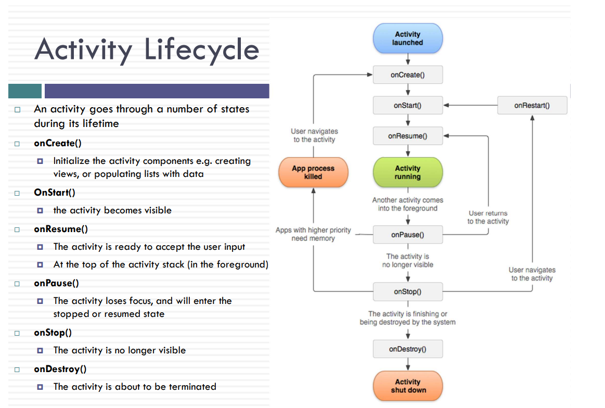


#### 4.Producing an Android App

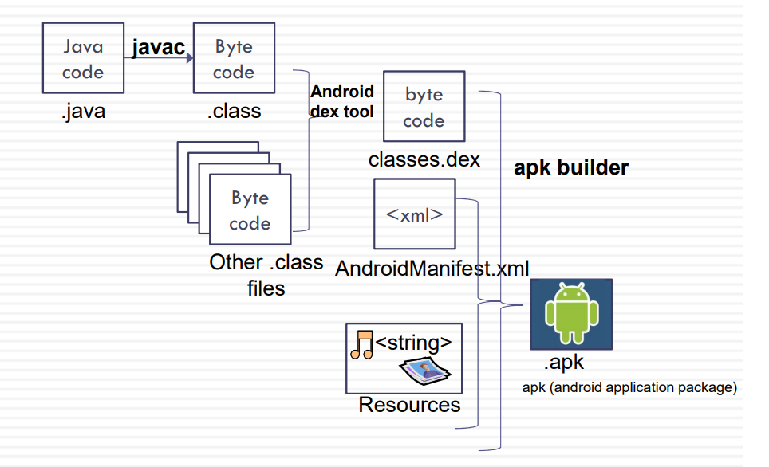

sign the app:

- The Android SDK and build tools automatically (by default) signs your  APK by creating the debug **keystore** and certificate for  testing/profiling purposes
- To distribute your APK on the app store (release to Google Play), it  must be digitally signed with a release certificate   developer.android.com/studio/publish/app-signing.html


## Week03


## Week04


## Week05


## Week06


## Week07


## Week08


## Week09


## Week10


## Week11


## Week12


## Assessment


