# FIT5057 PM 初笔记

## Unit intro

### Unit Learning Outcomes

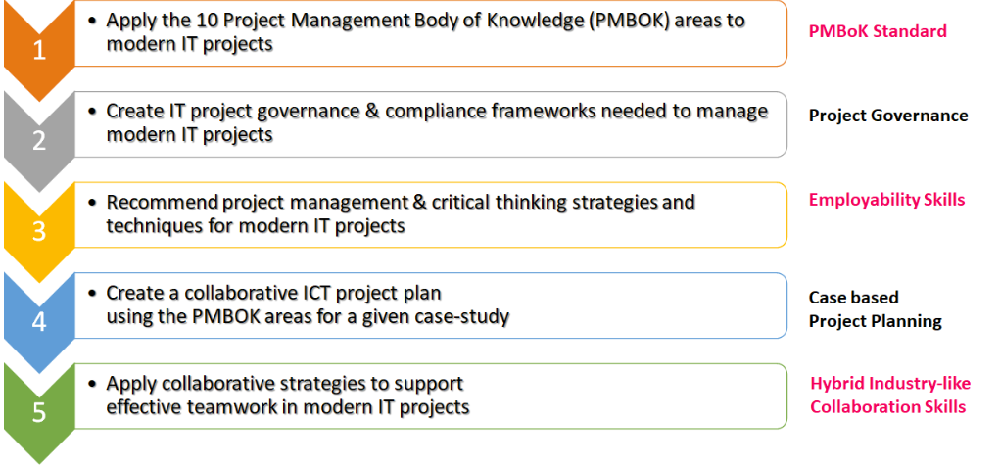

### 1. Unit schedule

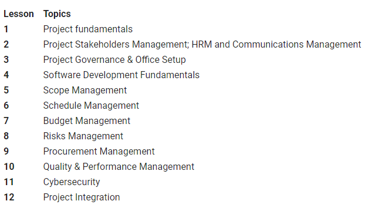

### 2. Teaching methods

1. Workshop(2h) 
2. Applied(2h)

### 3. Assessment 

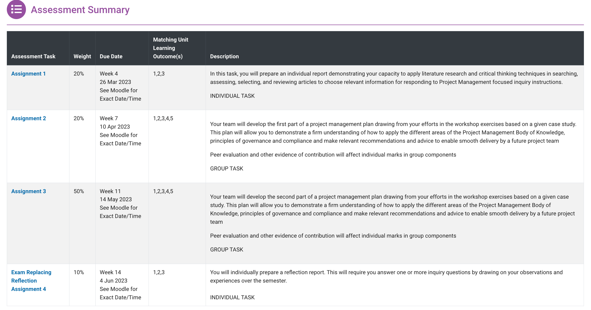

### 4.Learning Resources

1. online书籍([A Guide to the Project Management Body of Knowledge (PMBOK® Guide) — Sixth Edition and Agile Practice Guide (ENGLISH)](https://web.s.ebscohost.com/ehost/ebookviewer/ebook?sid=7ea4634d-ebc6-4bf2-b8c9-d6ebad73f7b2%40redis&ppid=pp_III_2&vid=0&format=EB))   ?
2. ED reading ？
3. Moodle网页 ？
4. FIT2002全笔记

## Week01：**Introduction to Project Management** 

### 1. Project

定义：a **temporary** endeavour undertaken to create a **unique** deliverable( product, service or result)

什么时候结束: end when their objectives have been reached or terminated 

比较: Operations is work done to **sustain** the business 

 

`Project Attributes(特点)`

1. **Unique purpose**
2. **Temporary** – has start and end date
3. Developed using **progressive** elaboration – projects  are defined broadly when they begin, but as time passes, the specific  details of the project become clearer. Therefore, projects should be  developed in increments.
4. Requires **resources** – include people, hardware,software,other.
5. Primary **sponsor** – provides direction and funding
6. **Uncertainty** – because difficult to make  estimations. External factors also cause uncertainty.

 

`IT project`

定义: **using** hardware, software, and networks to create a product, service

作用/价值:  In software projects, the changes deliver new or enhanced software systems that provide resources and capabilities that are of strategic significance or improve operational efficacy.

例子: create a smartphone application; update software;develop a driverless car

特点：

1. Planned beginning and  deadline **date**
2. Defined **outcome** and key ‘deliverables’ 
3. **Evaluated** time, cost, scope, performance, quality assurance and are fit for purpose it is intended
4. **Budget**
5. **Team** of skilled people

 

 `Project vs Operations`

| Project                                                      | Operations                                                   |
| ------------------------------------------------------------ | ------------------------------------------------------------ |
| 1. temporary group  with a start end date   2.  Produces a unique product,  service     3. fixed budget | 1. Ongoing execution  of activities  2. Produce the same  output repeatedly  3. Operations have to earn  profit to sustain the business |

 

`Five Phases of Project`

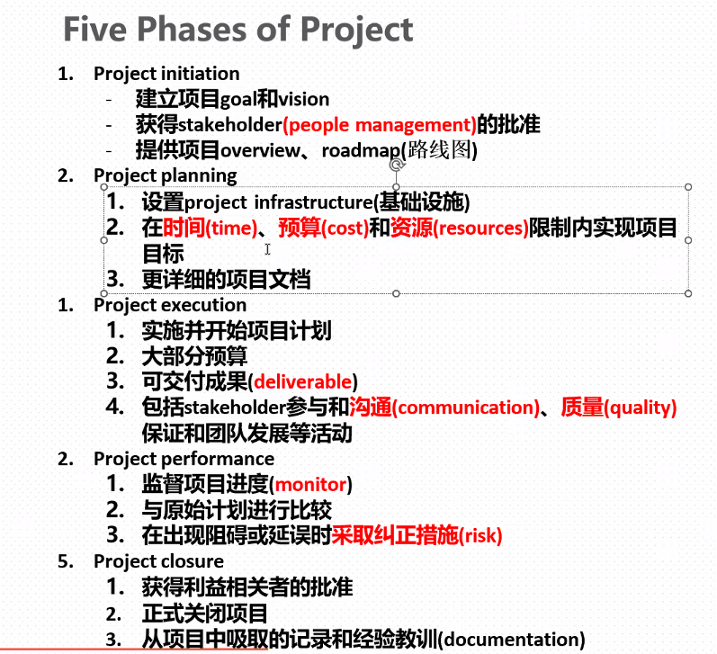

`Process Group`

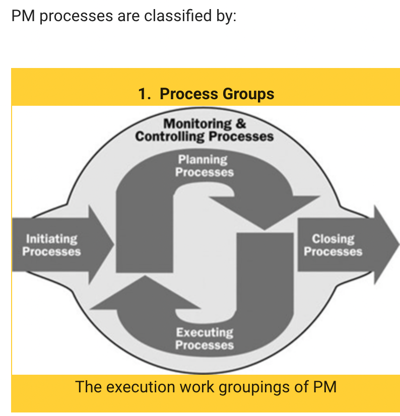

 

### 2. Project management

定义：PM is the **application** of knowledge, skills, tools and techniques to activities to **meet** project requirements/**deliver** something valuable to people.

 

PM优势好处/Why PM?：

1. Shorter development **times**
2. Lower **cost** and improved productivity
3. Positive impact on  meeting **scopes** and strategic goals
4. Higher quality and  increased reliability
5. Better control of financial, physical, and human resources
6. Better internal coordination，Higher work morale
7. Improved customer relations
8. Higher profit margin

 

#### 1.Triple Constraint

`The Triple Constraint of Project Management`

定义： scope(the result, the work), time,  cost(budget),  satisfy the project’s sponsor(meet the objectives and expections)

Time ↓ : cost ↑ and scope ↓

Cost ↓ ： time ↑ and scope ↓

Scope ↑： time ↑ and cost ↑

Scope ↓： time ↓ and cost ↓ quality ↓

#### 2.PM framework

`Project Management Framework`

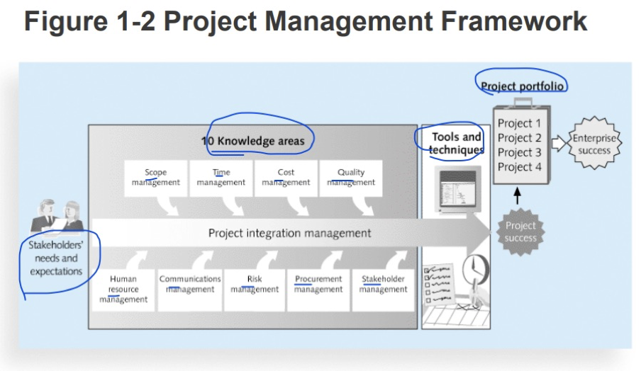

**1. Project stakeholders**

定义: A stakeholder is a person or an organization who has a “stake” or an **interest** in the performance or outcome of the project

例子：

●   project sponsor : senior management role

●   project manager: leader of the project, who works with the sponsor, team, other

●   project team: work together,communicate,commitment, efficient executing project goals,correctly map tasks to members’ competencies

●   support staff

●   suppliers

●   customers/ users

**2. Project management 10 knowledge areas**

定义: describe the key **competencies** that project managers must develop 

内容：

1. **Project integration management** – coordinating all knowledge areas together

2. **Project scope management** – defining and managing all the work required

3. **Project time management** – estimating how long it will take, developing the schedule, and ensuring timely completion

4. **Project cost management** – preparing and managing the budget

5. **Project quality management** – ensuring the project will satisfy the stated or implied needs

6. **Project resource management** – making effective use of the resources

7. **Project procurement management** – acquiring goods and services from project outsiders

8. **Project communication management -** how and what to communicate

9. **Project stakeholder management** – identifying and analysing stakeholder needs, and managing relationships with stakeholders

10. **Project risk management** – identifying, analysing and responding to risks

 

**3. Project management tools and techniques**

定义: assist project managers and their teams to carry out the work 

例子: 见 Common PM Tools and Techniques.pdf

 

**4. Project success**

定义项目成功:

1. meets scope, time, and cost 
2. satisfy the customer/sponsor.  
3. achieve its main objective ,   save money and increase profits, or make sponsors happy = success

如何帮助成功(Ways to help a project succeed):

●   Clear business objectives 

●   Executive support – has support from top management

●   Stakeholder management – communicating with stakeholders and meeting their needs

●   User involvement – engage stakeholders through all stages of the project

●   Measure performance – be able to measure project health using metrics to quantify progress

●   Tools – carefully select tools that align with the project and business goals

###  

### 3. Project manager

**1.The  Roles and Responsibilities of the Project Manager**`职责`

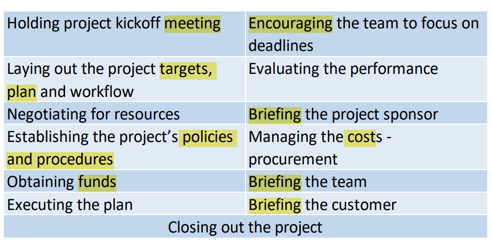

**2.Suggested Skills for the Project Manager:**`技能`

1. The Project Management Body of Knowledge(PMBOK)
2. Knowledge of the project environment – understand how the organisation works in the social, political and physical environment.
3. General management knowledge and skills– understand important business topics and know which areas are most important, and who is qualified to do the work. Make key project decisions and take responsibility
4. Soft skills 
   1. People skills   
   2.  Leadership  
   3. Listening 
   4.  Integrity, ethical behavior, consistent    
   5. Strong at building trust      
   6. Verbal communication 
   7. Strong at building teams          
   8. Conflict resolution, conflict management 
   9. Critical thinking, problem solving    
   10. Understands, balances prioritie
5. Technical skills – be able to make effective use of technology, but don’t have to be experts

### 4. Program+Portfolio

`Program`

定义: a group of related projects managed in a coordinated way to obtain benefits and control. 

`Program manager`: provides leadership and direction for project managers. They often have review meetings with all project managers to share information and coordinate related projects.

例子： boss

`Project managers`：work with project sponsors, project team, and other people involved in a project to meet project goals

例子： Project managers should be both leader(focuses on long-term goals) and manager(deals with the day-to-day details to meet specific goals)

-----

`Portfolio`

**Project Portfolio Management** Organisations group and manage projects and programs as a portfolio of investments that contribute the entire enterprise’s success.

**Portfolio managers** help organisations make wise investment decisions by selecting projects from a strategic perspective. They usually have strong financial and analytical skills.

分类（IT Portfolio Categories）：

●   Venture – projects that help transform the business 

●   Growth – projects that help company increase revenue 

●   Core – projects that must be accomplished to run the business (these must be funded) 

`Portfolio vs Project`

| Project Portfolio Management                   | Project Management                            |
| ---------------------------------------------- | --------------------------------------------- |
| Invest right?(Strategic goals,long-term)  对错 | Carry out well?(Tactical goals)  进行的好不好 |

 

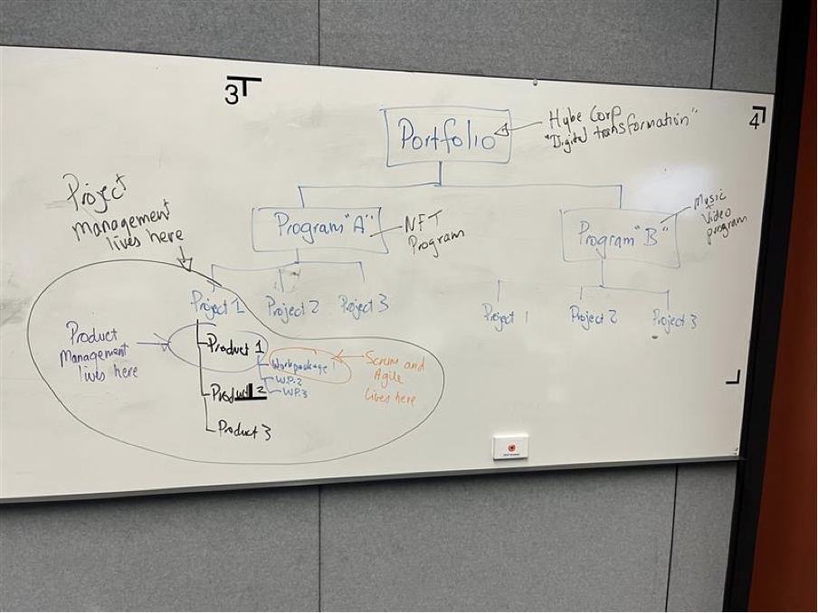

## Week02: Communication+Stakeholder+Resource management

### 1.Project Communication management

`重要性:`

1. Failure to communicate is a  great threat to projects. Good communication should be a priority. 
2. IT professionals should be able  to communicate effectively, and be strong in  verbal, written, and non-technical communication,which are a key factor in career advancement to succeed. Every team member should have both technical and soft skills

 

==Project Communication Management Process==

1. **Planning communications management** – determining the information and communication needs of the stakeholders 

2. **Managing communications** – creating, distributing, storing, retrieving, and disposing of project communications based on the communication management plan 
3. **Controlling communications** – monitoring and controlling communications to ensure stakeholder communication needs are met

 

`Keys to Good Communications 如何做?`

1. **Focus on group and individual communication needs** – understand everyone’s   preferences for communication. Personality differences, geographic location, and cultural background can lead to miscommunication. The   receiver may not interpret exactly what the sender intended. 
2. **Use  formal and informal methods** – communicating includes many different   dimensions, such as writing, speaking and listening. Research has  indicated that face-to-face interactions are most effective as people     communicate through body language, speech and content. Also, stand-up  meetings are effective, short, frequent meetings that force people to   focus on what they really need to communicate. 
3. **Distribute  important information in an effective**, timely manner – documents   should include detailed, technical information that affects critical performance.     Crucial information should not be buried, and project managers should not  be afraid to report bad information. Oral communication helps bring     important information to the forefront. 
4.  **Set the stage of bad news** – be sure to put  information in context, and understand how problems will affect the whole   project and organisation. Communicating bad news can allow project teams  to come up with ways to mitigate the problem
5. **Determine   the communication channels** – as the number of people involved increases, the   number of communication channels also increase.

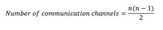

 

#### 1.Plan communication management

**Communications management plan** is a document that guides project communications. varies with the needs of the project.

 

Contents include: 

●   Stakeholder communications requirements/Analysi

定义：is a table that lists the stakeholder and their communication needs, including the document name, format, contact person, and when it’s due. 

作用: Helping the project manager manage communication by knowing the project information to the right people at the right time, and in a useful format

> Sample Stakeholder Analysis

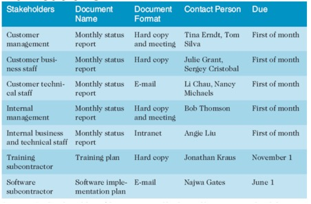

●   Information to be communicated  交流什么

●   Who will receive the information and who will produce it? Stakeholders 和谁交流

●   Suggested methods or technologies for conveying the information 通过什么交流

●   Frequency of communication  交流次数

●   Escalation procedures for resolving issues   如何解决问题

●   Revision procedures for updating the communication management plan 回顾和更新

●   Glossary of common terminology 术语表

 

#### 2.Managing Communications 

定义: Determining the most appropriate means for distributing different types of project information.

 

`Classification of Communication Methods: `

1. **Interactive communication** – two or more people interact to exchange information. Includes meetings, phone calls, or video conferencing. It’s the most effective way to ensure understanding. 

2. **Push communication** – information is sent/pushed to recipients without their request. Includes reports, emails, faxes, voice mails. It does not ensure that the information was received or understood

3. **Pull communication** – information is sent to recipients at their request. Includes websites, bulletin boards, e-learning, and blogs. 

 

`Performance reporting` involves keeping stakeholders informed on how resources are being used to achieve project objectives. 

Types of performance reports include: 

●   **Status reports**: describe where the project stands at a specific point in time

●    **Progress reports:** describe what the project team has accomplished during a certain period of time

●    **Forecasts**: predicts the future project status and progress based on past information

#### 3.Controlling Communications

The main goal is to ensure the optimal flow of information through the project life cycle. Various reporting systems, expert judgement, and meetings are used to assess how well communications are working. External facilitators can also assess how well communications are working

 

`Suggestions for Improving Project Communications: `

1. **Develop better communication skills** – it takes leadership to improve communication. Organisations should invest ways to improve communication with people from different countries and cultures
2.  **Run  effective meetings** – well-run meetings can foster team-building and relationships. Meetings should have a defined purpose and outcome, and be  properly prepared for.
3.  **Use  technologies effectively** – ensure the technology is an appropriate medium for what you want to communicate. Collaborative tools include SharePoint, Google Docs,email,message.

4. **Use  templates** – many organisations provide examples and templates to save time and cost. 

Templates are helpful for people who have never written documents or given presentations, and provide a standard way to communicate the information needed.

 

**Lessons-Learned Report** is a reflective statement that documents important things an individual learned from working on the project. It provides valuable reflections on what worked and didn’t work. The project manager would combine information from all the lessons-learned reports into a **project summary report**. These documents are excellent resources for future projects. 

**Project archives** are a complete set of organised project records to provide an accurate history of the project. Archives provide valuable information for future projects as well. Many project teams create a project Web site to store important product documents and other information

### 2.Project Stakeholder management

`重要性`

1.aims to identify all people and/or organisations affected by a project, analyse stakeholder expectations, and effectively engage stakeholders

2.Projects Often Cause Change. 

- Project Managers can be viewed as **enemies** if the project resulted in job losses for some stakeholders 
-  **allies** because projects can lead to profit, produce new jobs or increase pay for stakeholders. 
- Project managers must learn to identify, understand, and work with a variety of stakeholders.

 

`Situations That Lead to Project Sabotage`

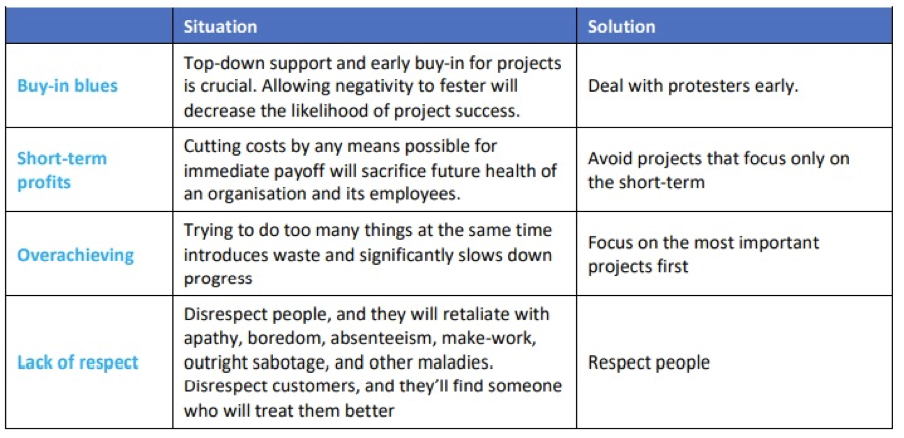

 

==Project Stakeholder Management Processes:==

1.**Identifying stakeholders** – identify everyone involved or affected by the project, and determine the best ways to manage relationships with them 

2.**Planning stakeholder management** – determine strategies to effectively engage stakeholders

3.**Manage stakeholder engagemen**t – communicate and work with stakeholders to satisfy their needs and expectations, resolve issues, foster engagement in project decisions 

4.**Control stakeholder engagemen**t – monitor stakeholder relationships and adjust plans and strategies for engaging stakeholders as needed

 

#### 1.Indentify stakeholder

`Stakeholders`: individuals, groups, or organisations who may affect, be affected by, or perceive themselves to be affected by a decision, activity, or outcome of a project

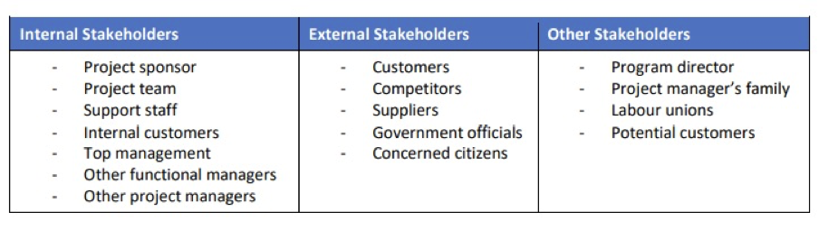

`Stakeholder register`: a document that contains the basic information on 

●   Identification information – names, position, location, roles, and contact information 

●   Assessment information – major requirements and expectations, potential influences, and phases of the project which stakeholders have the most interest 

●   Stakeholder classification – internal vs external, supporter vs resistant 

 

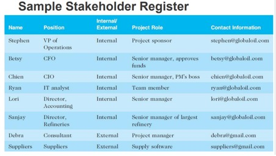

 

`Classifying Stakeholders`

目的: determine an approach for managing stakeholder relationships 

Power/Interest Grid is a classification tool used to group stakeholders based on power and interest.

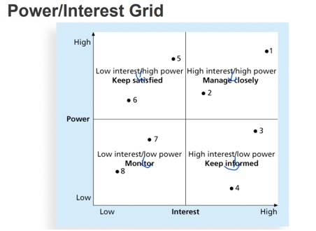

 

`Classifying stakeholder engagement levels:` 

●   Unaware – unaware of the project and potential impacts 

●   Resistant – aware of project, resistant to change 

●   Neural – aware of project, neither supports nor resists it 

●   Supporting – aware of the project, supportive of change 

●   Leading – aware of the project, engaged in helping it succeed

 

 

#### 2.Planning Stakeholder Management

After identifying and analysing stakeholders, project teams should develop a stakeholder management plan to help effectively engage stakeholders and make sure good decisions are being made

 

`Sensitive Information / stakeholder analysis` 

The stakeholder management plan often includes sensitive information. Stakeholder analysis is part of it.

The stakeholder communication analysis should be allowed to be reviewed and approved by stakeholders, while stakeholder analysis is more sensitive, and not part of official project documents. 

 

`Stakeholder analysis` is a technique for analysing which stakeholders’ interests to focus on and how to increase stakeholder support throughout the project. 

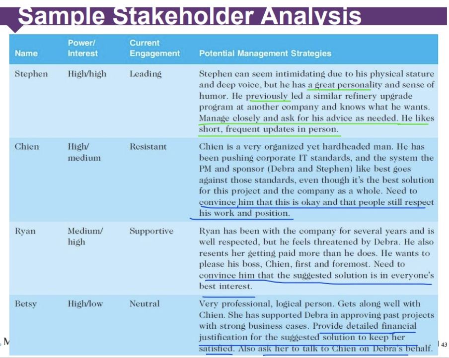 

 `Stakegolder engagement form`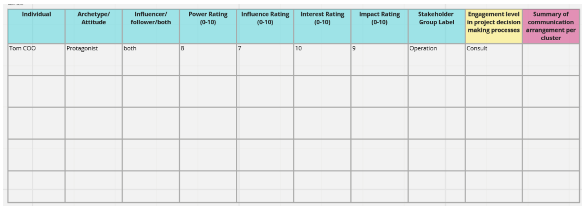

#### 3.Managing Stakeholder Engagement 

Project success can be measured in terms of customer/sponsor satisfaction. Project sponsors often rank scope, time, and cost goals in order of importance and provide guidelines on how to balance them. This ranking can be shown in an **expectations management matrix**, which helps clarify expectations.

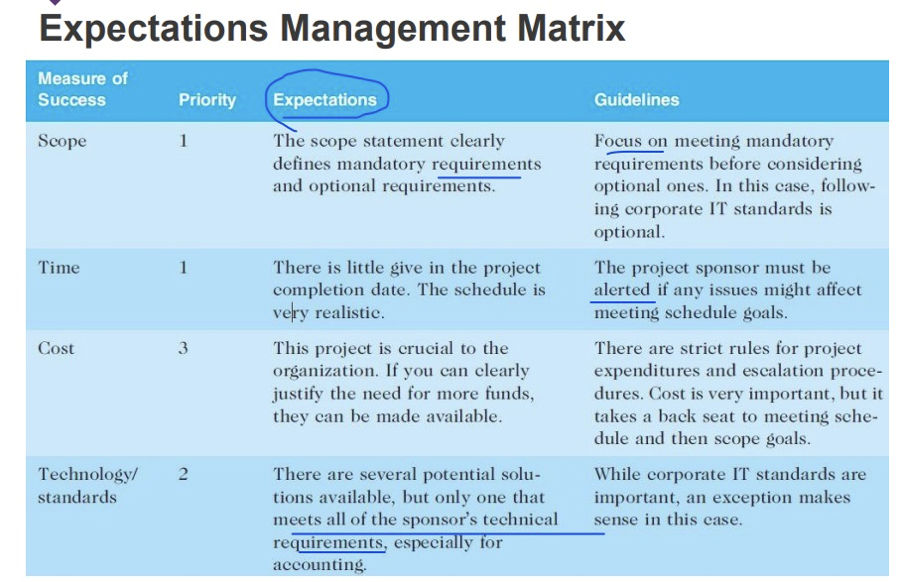

 

`Issue logs` 

定义: is a tool that is used to document, monitor and track issues that need resolution. Understanding the stakeholders’ expectations can help in managing issues. 

原因: Unresolved issues can be a major source of conflict and result in stakeholder expectations not being met. Other knowledge areas can be addressed in an issue log as well, in which stakeholders should be informed about. 

如何做: focus on high or medium priority issues

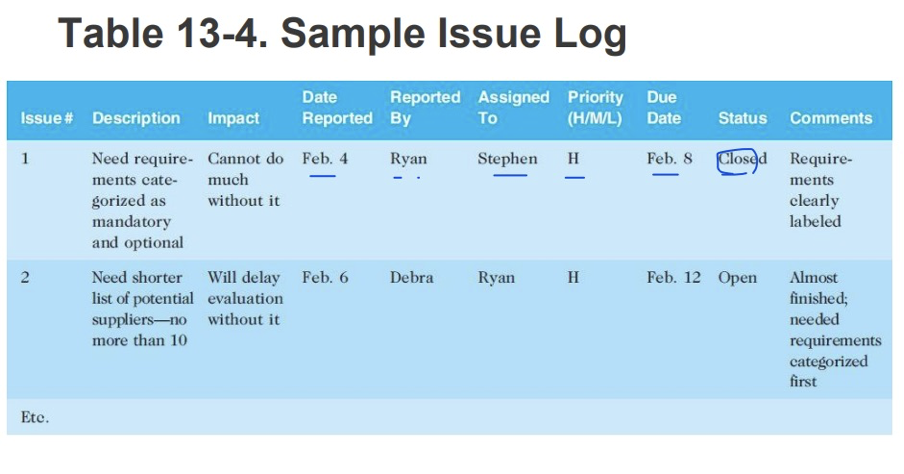

 

`When you can’t meet stakeholder requests: `

●   **Be clear from the start** – ensure everyone is on the same page, highlight how project supports organisational goals, and how requirements fit in with the big picture

●   **Explain** the consequences – ensure stakeholders understand the logic of the decision, even if they don’t like the decision 

●   Have a **contingency** plan – may be to just ignore the adversity, or get a senior manager involved 

●   **Avoid surprises** – be honest about project challenges

●   **Take a stand** – project managers to lead and take ownership of the decisions, acknowledge the need for change and stand up for what they think is the best solution 

 

#### 4.Controlling Stakeholder Engagement

Engagement involves a dialogue in which people seek understanding and solutions to issues of mutual concern. A way to control stakeholder engagement is to set the right tone. Key stakeholders should be invited to participate in **a kick-off meeting**, where it can be emphasised that dialogue is expected at meetings, along with communication mediums that stakeholders prefer. The project manager should meet with important stakeholders before the kick-off meeting. 

The project schedule should also include activities and deliverables related to stakeholder engagement, such as surveys, reviews, demonstrations, and sign-offs.

 

`Software to assist in stakeholder management: `

1.**Productivity and communication software** – eg. word processors, spreadsheets, presentations, emails, chats, and blogs can help communicate information to stakeholders 

2.**Collaboration tools** – eg. Google docs, wikis, virtual meetings can also help communicate and work with stakeholders 

3.**Social media** – can be used to network and build relationships with team members. It’s important to focus on controlling stakeholder engagement and meeting stakeholder needs, rather than just using the latest technologies. 

### 3. Project Resource Management 

定义：PRM involves identifying, acquiring, and managing the resources needed to complete the project successfully. 

 

==Project Resource Management Processes:==

1. **Planning resource management** – defining how to estimate, acquire, manage, and utilize resources 

2. **Estimate activity resources** – estimating the type and quantity of materials, equipment, and supplies 

3. **Acquiring resources** – getting the necessary resources and personnel required for the project 

4. **Developing the project team** – building individual and group skills to enhance performance 

5. **Managing the project team** – tracking performance, motivating team, providing feedback, resolving conflicts, and coordinating changes to enhance performance 

6. **Control resources** – ensure physical resources that are assigned and allocated is available as planned, and performing corrective action 

 

 

`The Importance of Human Resource Management`

Human resources refer specifically to the people working on the project. 

1. People are the most important asset, and they determine the success and failure of a project. Therefore, organisations need to fulfil the **needs** of individual people in order to implement projects successfully. 

2. Proactive organisations address **workforce needs** by improving benefits, redefining work hours and incentives, and finding future workers. 

  

**Maslow’s Hierarchy of Needs** 人的需求层次

states that people’s behaviours are guided or motivated by a sequence of needs. Once physiological needs are satisfied, then safety needs will guide behaviour, and so on. The project manager also should understand each team members’ motivations, regarding social, esteem and self-actualisation. 

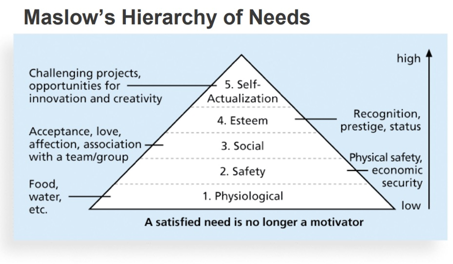

**Herzberg Motivational and Hygiene Factors**

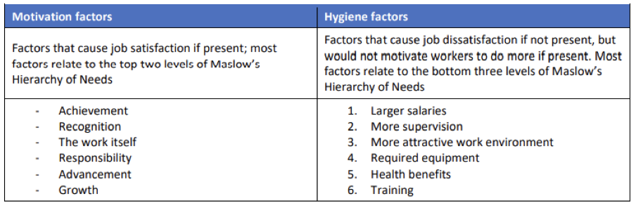

**McGregor’s Theory X and Y** 

●   Theory X – assumes workers dislike and avoid work, so managers use coercion, threats and control schemes to get workers to meet objectives 

●   Theory Y – assumes individuals consider work as natural as play or rest and enjoy the satisfaction of esteem and self-actualisation needs 

●   Theory Z – motivates workers by emphasising trust, quality, collective decision-making and cultural values. As opposed to X and Y, theory Z focuses on how workers view management.

 

#### 1. Plan Human Resource

This process involves identifying and documenting project roles, responsibilities and reporting relationships. 

内容: project organisational charts, staffing management plan, responsibility assignment matrices, and resource histograms

●   **Organisational Breakdown Structure** (OBS) is a specific type of organisational chart that shows which organisational units are responsible for which work items. 

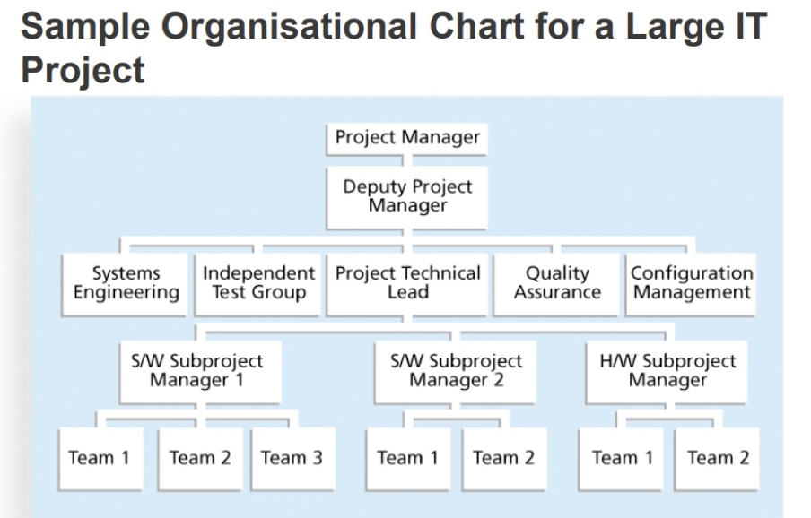

- **Responsibility Assignment Matrix** (RAM) is a matrix that maps the work of the project described in the WBS to the people responsible for performing the work designed in the OBS.

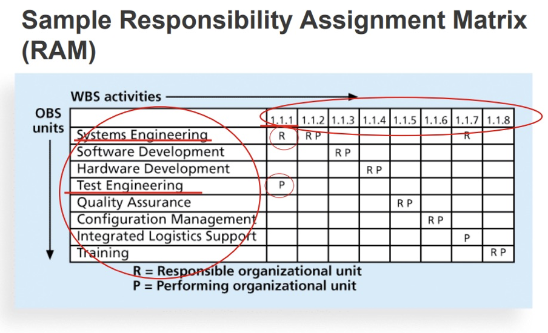

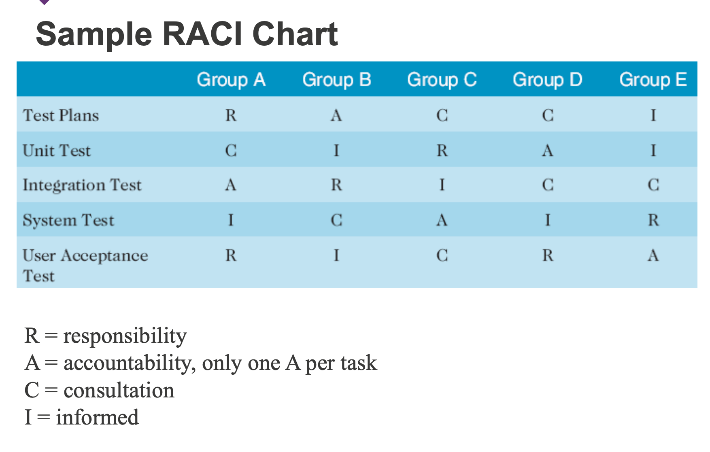

●   **Staffing management plan** describes when and how people will be added to and taken off the project team, and also how resources would be acquired, trained, rewarded and reassigned.

●   **Resource histogram** is a column chart that shows the number of resources assigned to a project over time

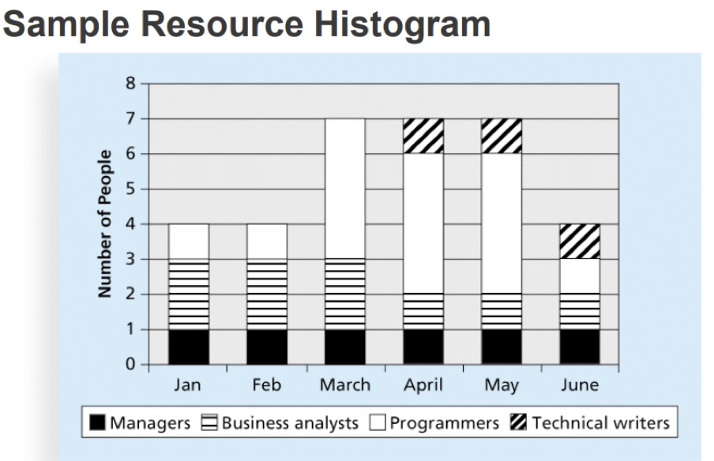

#### 2.Acquiring the Project Team

It’s important to assign the appropriate type and number of people to work on projects at the appropriate times. 

**Staffing plans** are used to maintain a complete and accurate inventory of employees’ skills.

**Resource assignment** – personnel may come internally or externally.

1.  It’s important to assign people that best fit the skills and needs of the project.
2. It’s also important to have good procedures for hiring subcontractors and recruiting new employees

 

Once people are assigned to projects, two techniques are available to project managers that help them use project staff most effectively: resource loading and resource leveling.

- **Resource loading** refers to the amount of individual resources an existing schedule requires during specific time periods. It helps project managers develop an understanding of the demands a project will make on the organisation’s resources and people’s schedules. A resource histogram is helpful in determining staffing needs and if there is **overallocation**, which means there’s not enough resources available to perform the assigned work in a given time period.

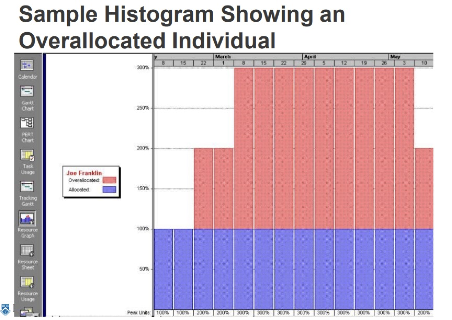

- **Resource levelling** is a technique used for resolving resource conflicts by delaying tasks. The main purpose is to create a smoother distribution of resource usage and reduce overallocation. 

`Benefits of Resource Levelling: `

●   Less management required when resources are used more consistently

●   It may enable project managers to use a just-in-time inventory policy for using subcontractors or other expensive resources 

●   Results in fewer problems for personnel and accounting departments 

●   Improves morale 

 

#### 3.Developing the Project Team 

The main goal is to help people work together more effectively and improve overall project performance. **Teamwork** is an important factor in the successful completion of projects.

 

`Tuckman’s Model` describes five stages of team development: 

1. **Forming** – introduction of team members

2. **Storming** – team members have different opinions on how the team should operate 

3. **Norming** – team members develop a common working method 

4. **Performing** – emphasis is on reaching team goals, team members build relationships with each other 

5. **Adjourning** – break-up of team members after successfully reaching its goals 

 

 `Training`

Training helps people understand themselves, and each other, and how to work better in teams. It’s important to make sure the timing and delivery method for the training is appropriate for specific situations and individuals. 

Eg. Sarah needs to learn to work with difficult people, so training in a new programming language would be unhelpful. 

 `Team-Building Activities`

1. Physical challenges – builds team bond, helps strangers work together more effectively 
2. Psychological preference indicator tools – helps individuals learn about themselves and each other 

- DISC profile

  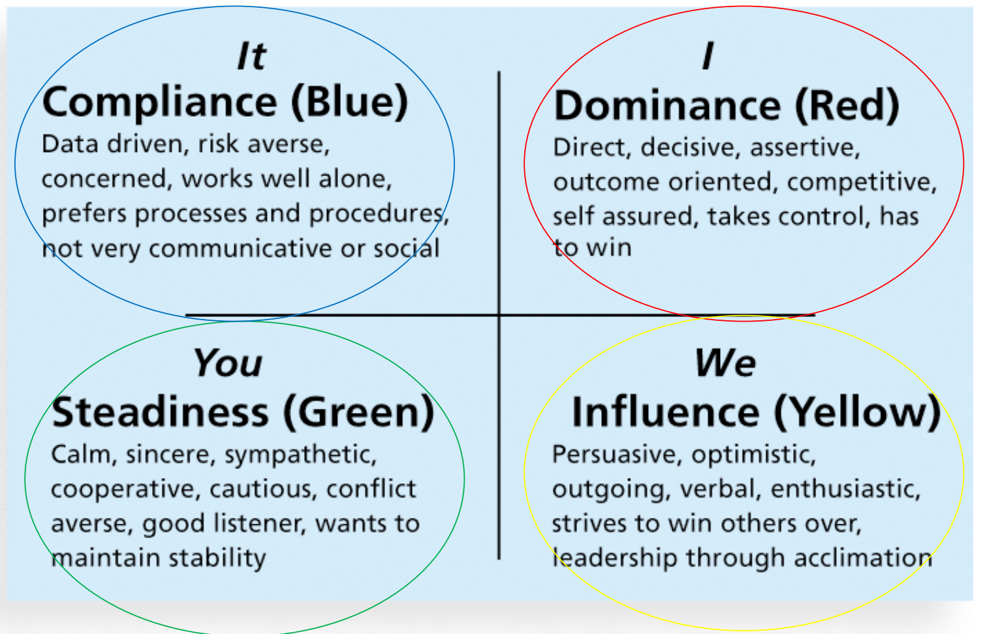

`Reward and Recognition Systems`

 If management rewards teamwork, it will promote or reinforce the philosophy that people work more effectively in teams. Project managers should continually assess their team’s performance and find areas where individuals or the entire team can improve. There should be a focus on rewarding teams for achieving specific goals. 

 

 

#### 4.Managing the project team

定义: lead their teams in performing various project activities

 

`Tools and Techniques for Managing Project Teams `

●   **Observation and conversation** – observe, assess performance, and ask how they’re going 

●   **Project performance appraisals** – provide timely performance feedback 

●   **Interpersonal skills** – focus on leadership, influencing, and decision-making skills 

●   **Conflict management** – understand strategies for handling conflicts 

 

`Conflict Handling Modes: `

1. **Confrontation** – directly face a conflict using a problem-solving approach 

2. **Compromise** – bargain and search for solutions that bring some satisfaction to all parties 

3. **Smoothing** – de-emphasis areas of difference and emphasis areas of agreement 

4. **Forcing** – project managers exert their viewpoint 

5. **Withdrawal** – retreat from the disagreement (avoiding) 

6. **Collaborating** – incorporating different viewpoints and insights to develop a consensus

 

**Conflict Can Be Good** 

1. Conflict often produces  important **results**, such as new ideas,   better alternatives, and motivation to work harder and more collaboratively. 
2. A lack of conflicting viewpoints  can cause groupthink, which is **conformance**   to the values or ethical standards of a group. This is undesirable  when it causes people to shy away from bringing up new ideas. 
3. Research suggests that  **task-related conflict** improves team performance, but emotional conflict depresses team performance. 

 

**The Five problems of Teams** **问题**

1. Absence of trust 
2. Fear of conflict 
3. Lack of commitment 
4. Avoidance of accountability 
5. Inattention to results 

 

**How to ensure a productive team: PM如何做**

1. Be patient and kind; assume the best of people 
2. Fix the problem, don’t blame people 
3. Establish regular, effective meetings focusing on meeting project objectives 
4. Allow time for teams to go  through Tuckman’s stages of team development 
5. Plan social activities to help  team members get to know each other 
6. Encourage team members to help each other 
7. Acknowledge individual and group accomplishments 

 

 

#### 5.Monitoring and controlling the resource

**Monitoring and Control** processes are used to measure and report progress, handle changes to scope, time, cost, and quality, manage the project team, risk strategies, and monitor procurement contracts. 

●   **Monitor** – collecting and reporting information concerning previously defined performance elements 

●   **Control** – using the information supplied by monitoring techniques to bring project actual results in line with stated performance standards

 

`Keys to Effective Monitoring and Controlling: `

1. **Honest environment** – foster an environment that allows for honest reporting of results     
2. **Reduce bias** – reporting process should as automated as possible, and separate responsibilities 
3. **Time** – allocate time in  the schedule for monitoring and controlling 
4. **Training**  –  ensure members of the project team, stakeholders and managers are trained in effective monitoring and controlling

`Project related data` includes information from all areas of the project including: schedule, costs, quality, risks, human resources, and if needed procurement

`Performance Report Categories`

- Progress reports – physical progress to date, Actual data vs. planned data
-  Status reports – identify where the project is today (the date the report is prepared) and the information from collected performance data to calculate Schedule Variance and Cost Variance 
- Projection reports – calculate the following
  - Earned Value numbers – Estimate at Completion (EAC), Estimate to Complete (ETC), Schedule Performance Index (SPI), and Cost Performance Index (CPI). 
  -  The report is forward looking giving projections/forecasts of the project finish 

- Exception reports – exceptions, problems, risks

### 4.Process Group

A **process** is a series of actions directed toward a particular result. Project management can be viewed as a number of interlinked processes.

10 PMBOK -> 49 processes -> 5 groups

`5 Process Groups`

1. **Initiating** – defining and authorising a project or project phase 

2. **Planning** – devising and maintaining a workable scheme to ensure that the project addresses the organisation’s needs

3. **Executing** – coordinating people and other resources to carry out the various plans and create the product, service or result of the project or phase 

4. **Monitoring and Controlling** – regularly measuring and monitoring progress to ensure the project team meets the project objectives 

5. **Closing** – formalising acceptance of the project or phase and ending it efficiently 

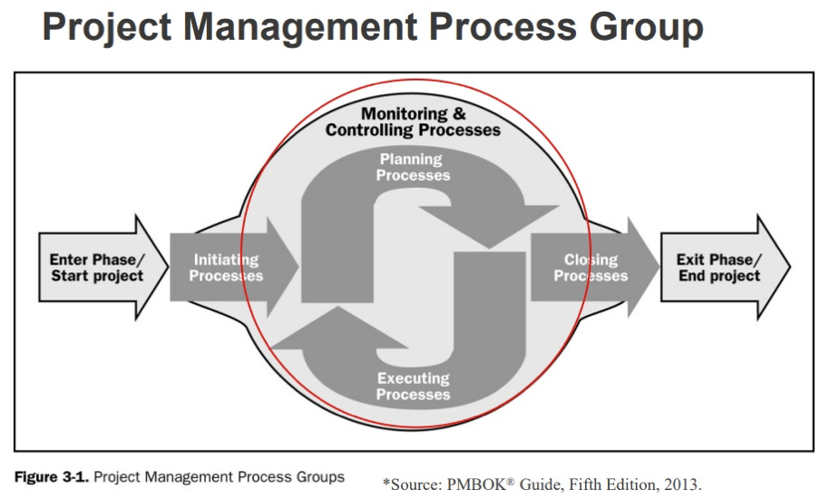 

Process groups are involved and repeated in every phase of the project life cycle. They can occur concurrently, and not necessarily one after the other. Map into 10 areas

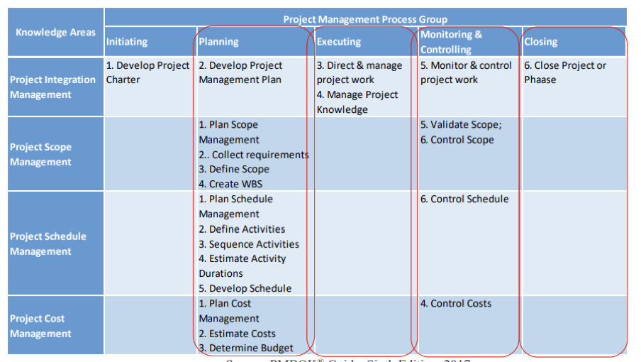

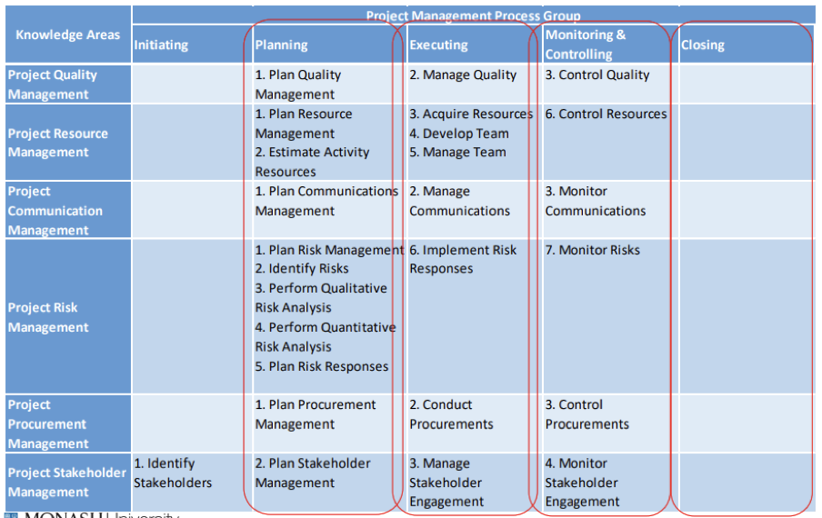

## Week03

## Week04

## Week05

## Week06

## Week07

## Week08

## Week09

## Week10

## Week11

## Week12

## Assessment

