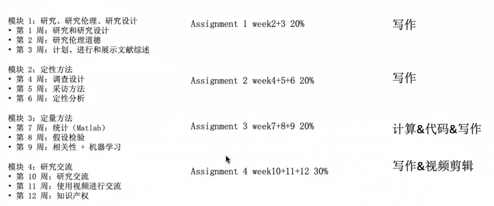

# FIT5125 IT research methods 初笔记

## Unit intro

In this unit, will learn core research methods that are commonly applied within the IT sector, giving you a flavour of the types of **methods** available, and some of the wider **concerns** to be aware of when you are involved in creating knowledge within an organisation.
在本单元中，您将快速了解 IT 部门中常用的核心研究方法的横截面，让您了解可用的方法类型，以及在您进行研究时需要注意的一些更广泛的问题参与在组织内创造知识。

### 1. Unit schedule

### 2. Teaching methods

1. Lecture(1h)：自己提前看，还有1h zoom 答疑

   https://monash.zoom.us/j/85229506329?pwd=d0ZhcDgzcllyUmcxMkRYdEZmdVBGQT09

2. Studio(2h)：大课，我是Group A

3. 4个Assignment

### 3. Assessment

Submission format：`PDF`

### 4.Learning Resource

1.Moodle资源：give you a basic understanding of the methods involved, and where and how they can be applied. 

2.同学笔记 https://greenh47.github.io/mynote/course_notes/fit5125/

## Week01:Design a Research Question

### 1.Research

`Research`

定义：A systematic process of collecting, analysing, and interpreting information (data) to discover  new facts, procedures, methods and techniques or better understand them

目的：create new knowledge

Observation & Experiment provides ‘facts’ and evaluates theory

Theory provides models and theories of reality

`Research methods `

定义：are the **skills and practices** that create knowledge that inform the day-to-day innovation that happens in companies across the world.

目的：help create new knowledge

本质：

- Use different tools for data collection + using different types of research methods. 

- A strategy that focuses on researching the problem and developing appropriate solutions.

**Research methods/designs, split into 4 categories** 

- Framing your research (including framing, ethics and literature); 
- Qualitative methods – which are used when asking questions of people directly (such as interviews, focus groups and questionnaires); 
- Quantitative methods – used when you need to analyse and answer questions on numerical data (includes useful statistical approaches, and an understanding of machine learning) 
- how to communicate and protect the new generated knowledge.

`Research process in IT`

The **research process** in information technology involves `5` steps: 

- posing a question or problem
- formulating goals and objectives
- Plan and Design research
- implementing and generate research results
- analysing and interpreting the results.

### 2.Research question

Questions such as: 诸如此类的问题：

- “How do you know if changing the UI on your e-commerce site will affect user dwell-time?”,
  “你怎么知道改变电子商务网站的用户界面是否会影响用户停留时间？”，
- “How is your new search algorithm performing compared to competitors or your old version?”,
  “与竞争对手或您的旧版本相比，您的新搜索算法表现如何？”，
- “How reliable is my re-developed image recognition tool for my customers”
  “我重新开发的图像识别工具对我的客户来说有多可靠”
- “What are the core challenges my users are currently facing”
  “我的用户目前面临的核心挑战是什么”

## Week02

## Week03

## Week04

## Week05

## Week06

## Week07

## Week08

## Week09

## Week10

## Week11

## Week12

## Assessment

