# FIT5125 IT research methods 初笔记

## Unit intro

In this unit, will learn core **research methods** that are commonly applied within the IT sector and some of the wider **concerns** to be aware of when you are involved in creating knowledge within an organisation.
在本单元中，您将快速了解 IT 部门中常用的核心研究方法，以及在您进行研究时需要注意的一些更广泛的问题当你参与在组织内创造知识。

### 1. Unit schedule

### 2. Teaching methods

1. Lecture(1h)：自己提前看，还有1h zoom 答疑

   https://monash.zoom.us/j/85229506329?pwd=d0ZhcDgzcllyUmcxMkRYdEZmdVBGQT09

2. Studio(2h)：大课，我是Group A

3. 4个Assignment

### 3. Assessment

Submission format：`PDF`

### 4.Learning Resource

1.Moodle资源：give you a basic understanding of the methods involved, and where and how they can be applied. 

2.同学笔记 https://greenh47.github.io/mynote/course_notes/fit5125/

## Week01:Design a Research Question

**Creating a Research Question**: Asking the right research question requires careful preparation and practice. Only by asking the right question, can the knowledge you seek be created and used. Before any research method is applied, a sound research question must be identified.

### 1.Research

`Research`

定义：A systematic process of collecting, analysing, and interpreting information (data) to discover  new facts, procedures, methods and techniques or better understand them

目的：create new knowledge

Observation & Experiment provides ‘facts’ and evaluates theory

Theory provides models and theories of reality

`Research methods `

定义：are the **skills and practices** that create knowledge that inform the day-to-day innovation that happens in companies across the world.

目的：help create new knowledge

本质：

- Use different tools for data collection + using different types of research methods. 

- A strategy that focuses on researching the problem and developing appropriate solutions.

**Research methods/designs, split into 4 categories** 

- Framing your research (including framing, ethics and literature); 
- Qualitative methods – which are used when asking questions of people directly (such as interviews, focus groups and questionnaires); 
- Quantitative methods – used when you need to analyse and answer questions on numerical data (includes useful statistical approaches, and an understanding of machine learning) 
- how to communicate and protect the new generated knowledge.

`Research process in IT`

The **research process** in information technology involves `5` steps: 

- posing a question or problem
- formulating goals and objectives
- Plan and Design research
- implementing and generate research results
- analysing and interpreting the results.

### 2.Research question

Questions such as: 诸如此类的问题：

- “How do you know if changing the UI on your e-commerce site will affect user dwell-time?”,
  “你怎么知道改变电子商务网站的用户界面是否会影响用户停留时间？”，
- “How is your new search algorithm performing compared to competitors or your old version?”,
  “与竞争对手或您的旧版本相比，您的新搜索算法表现如何？”，
- “How reliable is my re-developed image recognition tool for my customers”
  “我重新开发的图像识别工具对我的客户来说有多可靠”
- “What are the core challenges my users are currently facing”
  “我的用户目前面临的核心挑战是什么”

## Week02:Research Ethics

**Ethical Assessment/Planning**: This is a core supporting method, which although does not relate to answer a research question directly, it helps you correctly frame your question, ensure if you are obtaining the right information (or any additional information), and most importantly makes you think about the fundamental reasons for conducting the research.

### 1.Ethics

定义：In any form of research or research community you need to be aware of legal, ethical and moral issues. Today there is national legislation, and institutional principles and processes that researchers must adhere to.

`Ethical Research原则`

1. Research merit & **integrity**:uses appropriate methods, appropriate qualified researchers, conducted with integrity
2. **Justice**: inclusion & recruitment of participants is fair, benefit is fairly distributed, outcomes accessible to participants
3. **Beneficence**: Potential benefit must justify risk or harm, participants must understand risks, researchers are responsible to tell them
4. **Respect** : privacy, confidentiality and cultural sensitivities of the participants, vulnerable participants must be protected…

- Informed consent is absolutely essential. Participants must be free to stop at any time. 

- Qualified researchers must use appropriate research designs. 

- “The well-being of the subject should take precedence over the interests of science and society”. 
- Use caution if participant is in dependent relationship with researcher. 
- There must be a favorable risk/ benefit ratio. 

`Ethics的复杂性`

研究的重要性和伦理问题的平衡

### 2.Ethics Dimensions

Dimensions/Issues of human-subject research

`Physical or psychological harm or abuse `

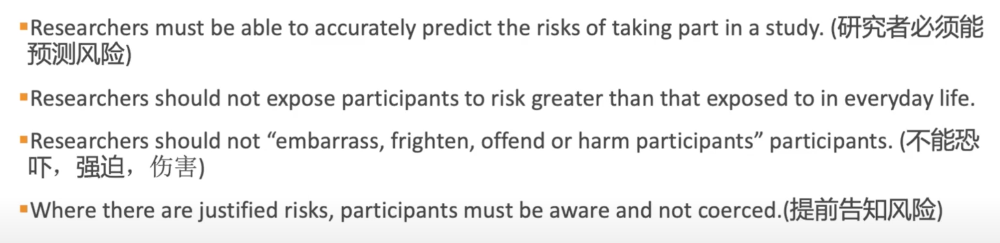

`Informed consent 知情权`

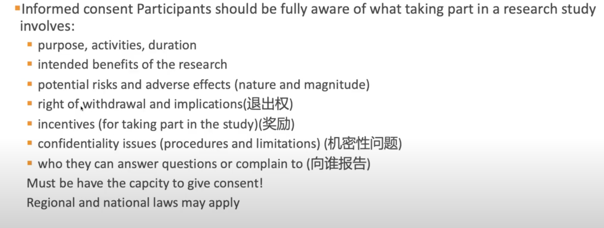

`Right of withdrawal退出权` 

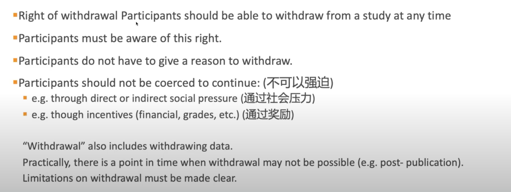

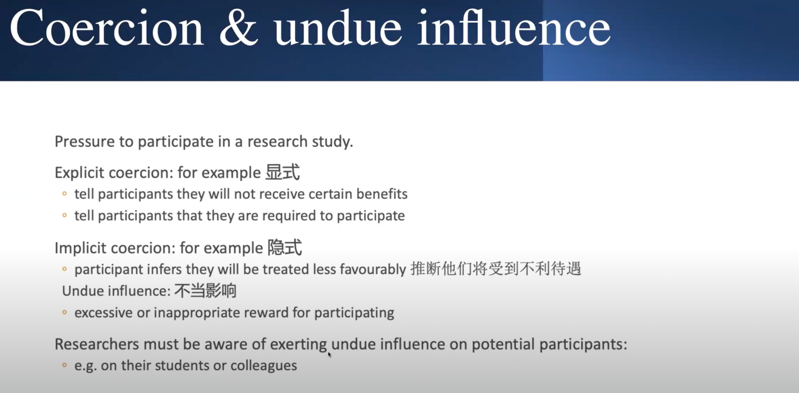

`Vulnerable participant groups `

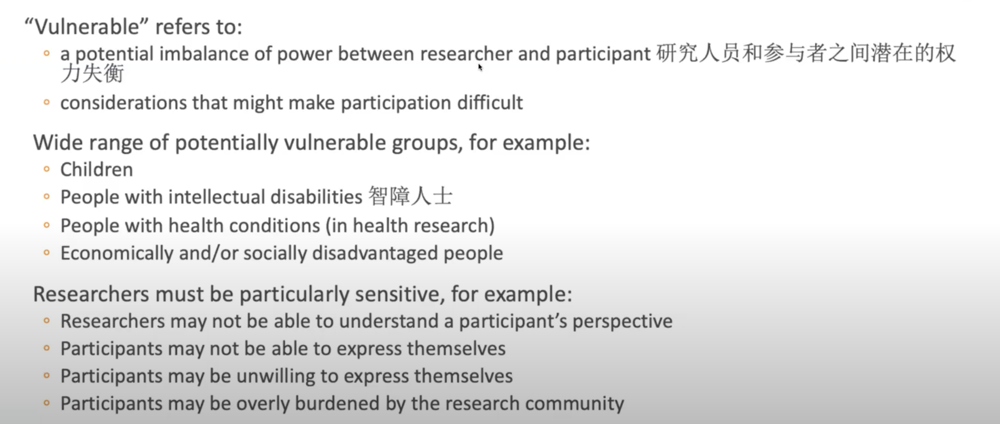

over burdened: 罕见病，那群人总是很忙

`Deception and coercion欺骗 `

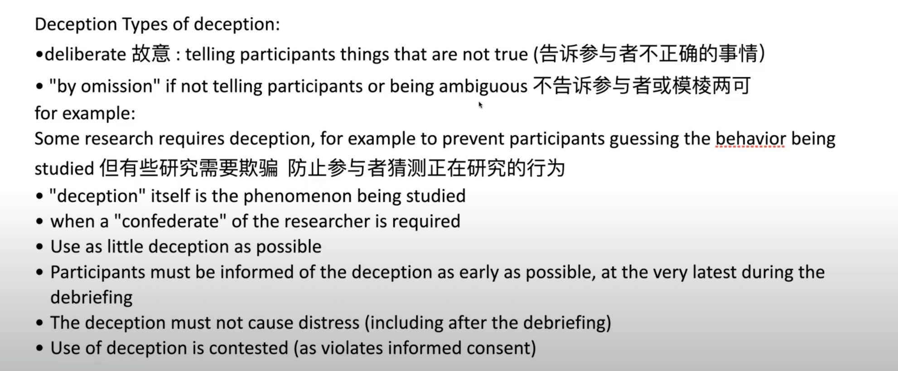

`Debriefing paticipants汇报`

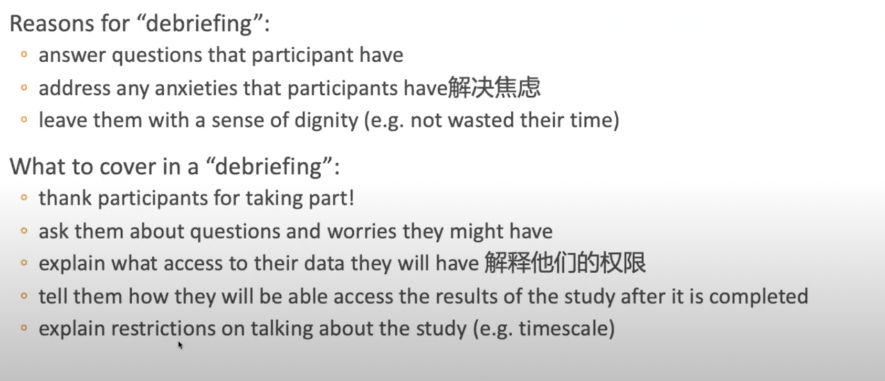

`Illegal practices `

Today there is national legislation, and institutional principles and processes that researchers must adhere to.

`Invasion of privacy `

告诉他们信息会被采用

`Confidentiality `

data泄露了

`Mangage Human subject data`

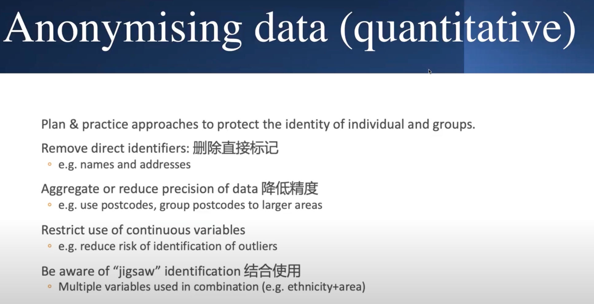

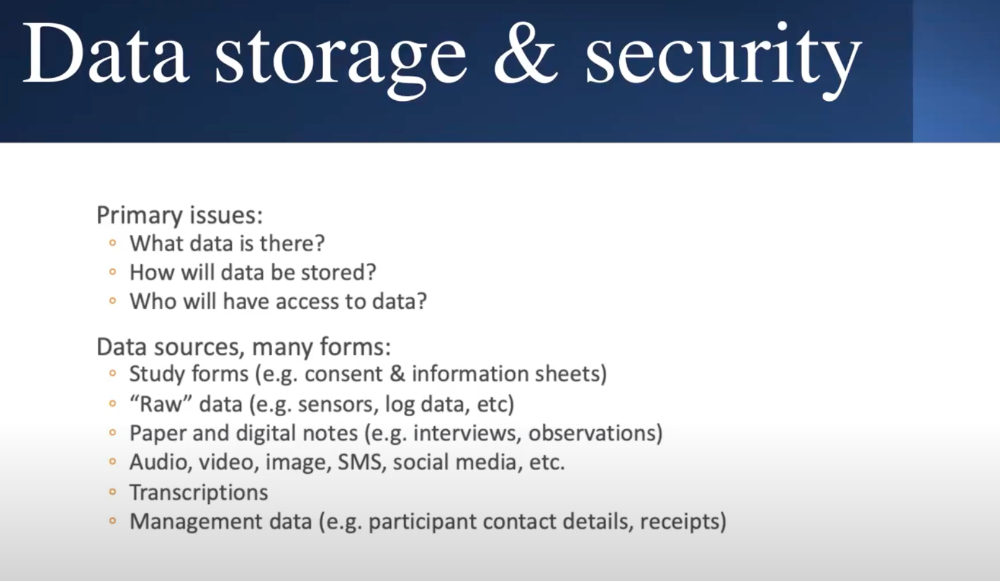

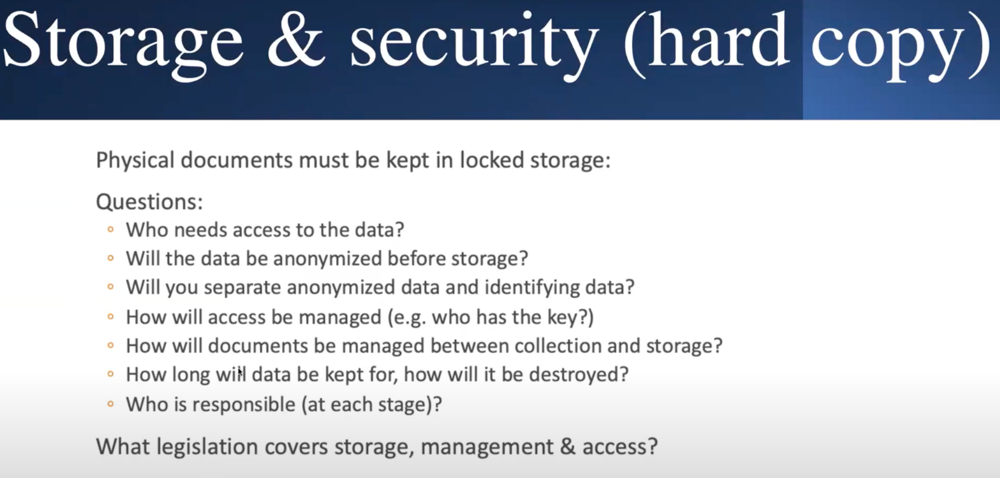

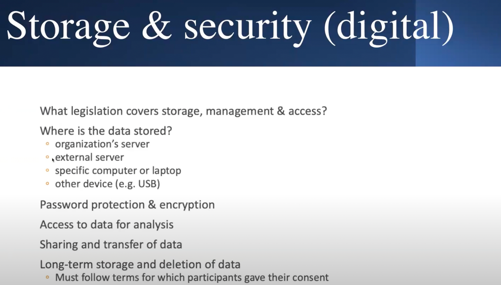

## Week03

## Week04

## Week05

## Week06

## Week07

## Week08

## Week09

## Week10

## Week11

## Week12

## Assessment

