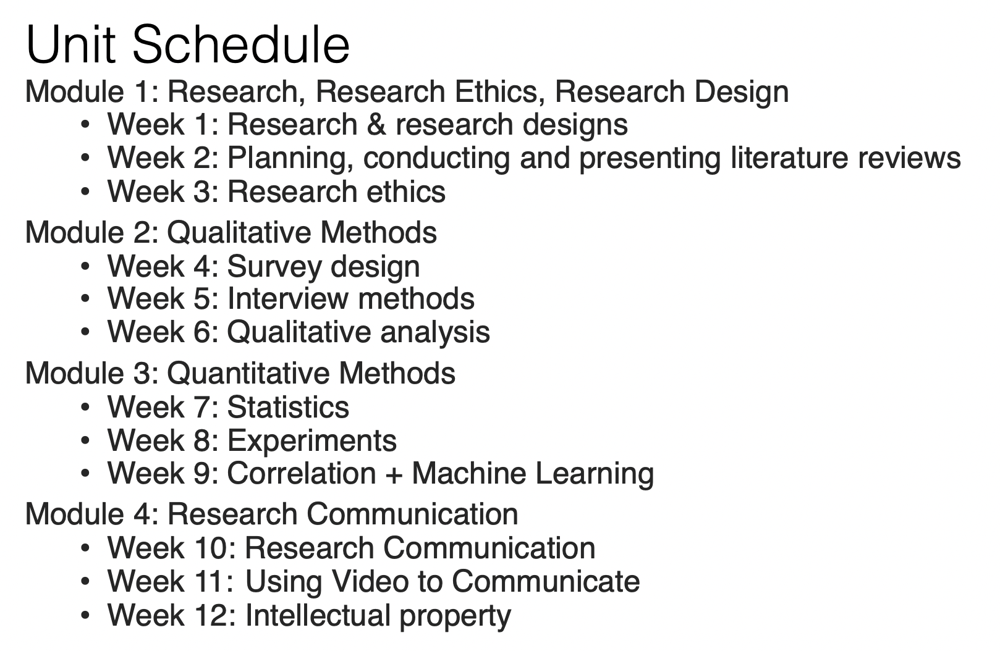
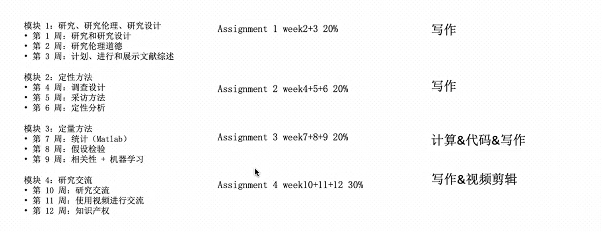
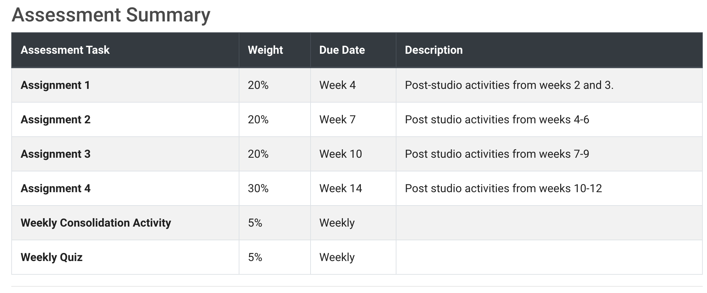
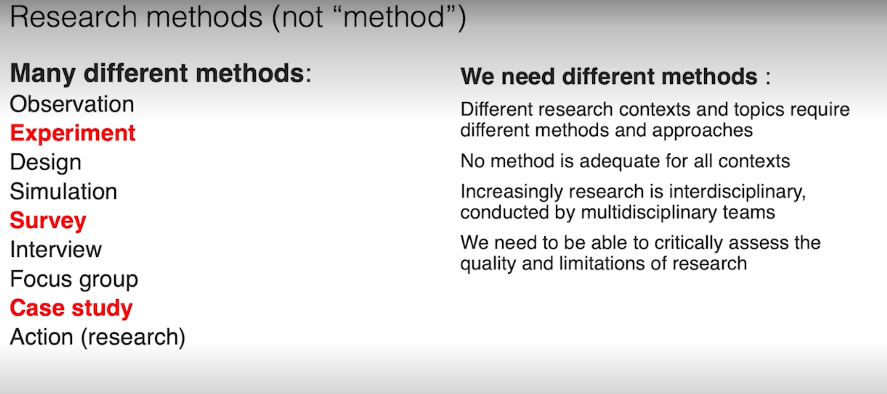

# FIT5125 IT research methods 初笔记

## Unit intro

### 1. Unit schedule

### 2. Teaching methods

1. Lecture(1h)：自己提前看，还有1h zoom 答疑

   https://monash.zoom.us/j/85229506329?pwd=d0ZhcDgzcllyUmcxMkRYdEZmdVBGQT09

2. Studio(2h)：大课，我是Group A

3. 4个Assignment

### 3. Assessment

Submission format：`PDF`

## Week01:Design a Research Question

### 1.Research

`Research`

定义：A systematic process of collecting, analysing, and interpreting information (data) to discover  new facts, procedures, methods and techniques or better understand them

目的：create new knowledge

Observation & Experiment provides ‘facts’ and evaluates theory

Theory provides models and theories of reality

`Research methods `

定义：are the **skills** and practices that create knowledge that inform the day-to-day innovation that happens in companies across the world.

目的：help create new knowledge

本质(如何帮助)：Use different tools for data collection + using different types of research methods. 

A strategy that focuses on researching the problem and developing appropriate solutions.

**Research methods, split into 4 categories** 

- Framing your research (including framing, ethics and literature); 
- Qualitative methods – which are used when asking questions of people directly (such as interviews, focus groups and questionnaires); 
- Quantitative methods – used when you need to analyse and answer questions on numerical data (includes useful statistical approaches, and an understanding of machine learning) 
- how to communicate and protect the new generated knowledge.

`Research process in IT`

The **research process** in information technology involves `5` steps: 

- posing a question or problem
- formulating goals and objectives
- Plan and Design research
- implementing and generate research results
- analysing and interpreting the results.

## Week02

## Week03

## Week04

## Week05

## Week06

## Week07

## Week08

## Week09

## Week10

## Week11

## Week12

## Assessment

