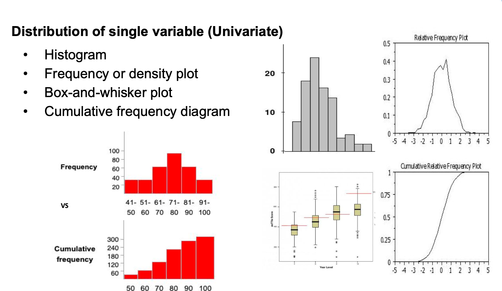
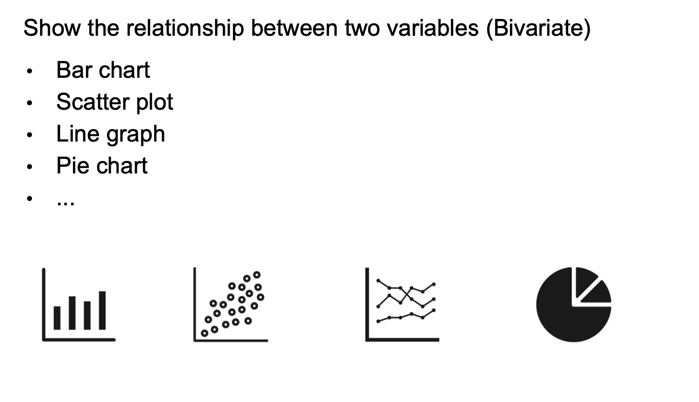
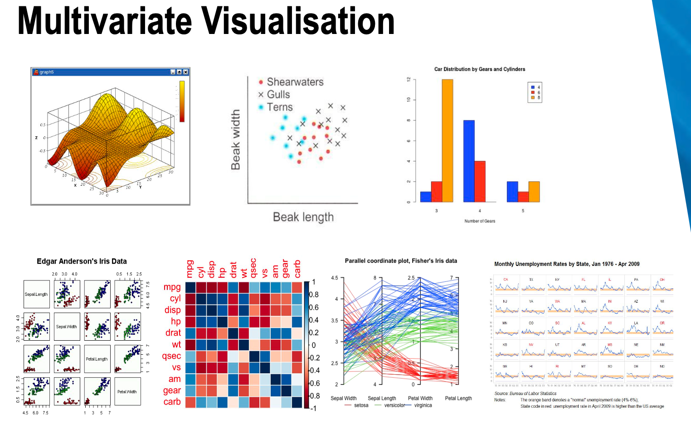
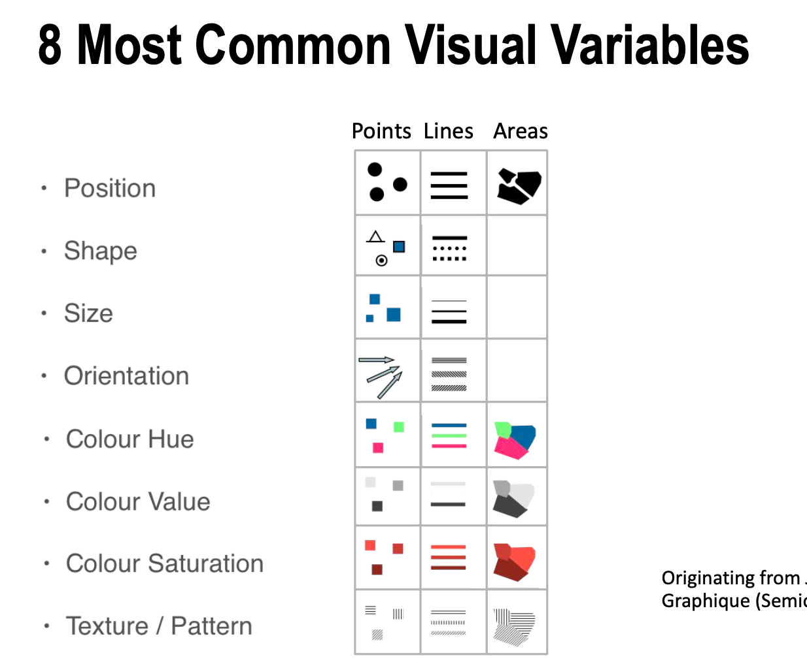

# FIT5046 Data explor and Visuali 初笔记

## Unit intro

### 1. Unit Schedule

### 2. Teaching methods

1. Workshop(2h) 
2. Tutorial(2h)

### 3. Assessment 

### 4.Learning Resources

1. Module网页自学

2. workshop ppt

3. Introduction to R - https://lms.monash.edu/course/view.php?id=34595%20

## R basic

## Week01:Intro

### 1.Role/purpose of Data visualisation

作用/目的

1. `检查Data checking and cleaning. `When you first get your data you should do some quick plots of the individual features to check that there are no obvious errors and to get a feel for the distribution of values.

   The following is a quick check list for each attribute:

   - Look at some random records
   - Compute the mean, median and quartiles for the data. Look at a box plot of these.
   - Determine the number of missing values and invalid values (NaNs), number of special values like 0.
   - Determine the number of distinct values and whether they really are distinct.
   - Plot the frequency distribution of values. This might be with a histogram or density plot. You should play around with the choice of bin width as this smooths the data.
   - Check for symmetry (skewness) and the flatness/spikiness of the distribution (‘kurtosis’, note platykurtic = flat distribution with low peak, leptokurtic = spikey peak around the mean).
   - Look at the outliers and check whether they should be thrown away (trimmed) rounded up or down (Winsorised). This might be done, for instance, for data outside the 5th and 95th percentiles.
   - Check formats for dates, that they are in comparable time zones.
   - Plot latitude and longitude on a map to check they are sensible.
   - Check text for strange characters or encoding

2. `发现Exploration and discovery`.when she gets a new data set, she starts by making a dozen or more scatter plots, trying to get a sense of what might be interesting. Visualisation **reveals possible connections and patterns and trends** that can then be confirmed (or not) using other kinds of analysis. Visualisation also plays a key role in understanding any kind of spatial data.

   Typical task during exploration are:

   - Search for elements that satisfy certain properties, if they exist. This might be locating a known data point, filtering the data, or finding outliers.
   - Identify the properties of a single data item
   - Compare or rank elements
   - Visually identify patterns in some subset of elements. Examples include trends, correlations, clusters or categories.
   - Calculate derived properties not originally in the data. These may be data transformations, data aggregations or may be statistical properties such as regression lines or clusters

3. `理解Presentation and communication of results.` This has two main purposes:

   (1) to help you and other modellers/analysts understand the results and 

   (2) to communicate the results to other stakeholders.

   不要：trying to create a cool looking InfoGraphic

   要：think about the best way to present your data and story and make sure that it communicates it effectively and does not simplify the story too much by hiding complexity.

==为什么会出现Data Visualization==

1. 科学技术的提高*Improved technology for producing and presenting graphics.* Widespread use of information graphics could not have happened without paper and printing and interactive data visualisation was impossible without the computer.
2. 社会需求*Changes in societal needs and attitudes to graphics.* The Scientific Revolution required scientific and medical illustrations, the Age of Exploration needed maps, the Industrial Revolution required engineering drawings and the 21st century requires interactive data visualisations.
3. 数据的可用性应用*Availability of data.* Detailed maps require accurate surveys while graphs showing population or wealth distribution require census data.
4. 图形符号和交互技术的发明*Invention of graphical notations and interaction techniques.* These allow the data to be shown in ways that are useful, that answer society’s needs. They form a visual language.

### 2.Tools for Data Exploration and Visualisation

`language`

1.**R**.One of the best of the graphics libraries is **ggplot2** by Hadley Wickham.

2.**Python**. This is a nicer language but does not have quite the choice of analysis packages. It is ideal for data wrangling and Python is often used for scrapping and fusing data, then R for exploration and visualisation.

3.JS **D3** creating interactive presentation graphics for the web

`visual analytics and Visualization tools`

**Visual analytics** is the  the combination of interactive visualisation with statistics, data mining and other kinds of analytics.

Aim is to "detect the expected and discover the unexpected.

#### 1.Tableau

commonly used by business intelligence for interactive exploration of tabular data

Open Tableau Public (TP), there are two ways to load the data:

- at the left top click **“Excel”** and navigate to the file you just downloaded.
- Just drag your file and drop it into Tableau Public window.

Click "Sheet 1" Shown on the left, data has been split into

- **Dimensions;** by default, Tableau treats any field containing qualitative, categorical information as a dimension;
- **Measures;** and any field containing numeric (quantitative) information as a measure.

> For our first visualisation, we will create a simple horizontal bar graph measuring City/Country against the Total Award Amounts granted to the artists from said locations.

- Drag ‘City,Country’ from **Dimensions** and drop it to **Rows**
- Drag ‘Total Award Amount’ from **Measures** and drop it to **Columns**
- Maybe also try to switch Rows and Columns

#### 2.R Studio

You will need R and RStudio, you will also need to install the following libraries (and dependencies):

- ggmap
- ggplot2
- maps
- mapproj

#### 3.D3

HTML5/SVG +JS. allows you to create dynamic and interactive data visualisation that can be viewed in a web browser.

- VS code,install "live server"
- html+JS

### 3.Designing Data Visualisations

#### 1.**what** you wish to visualise

`four kinds of dataset:`

- **Tabular dataset**: data that is conceptually organised into a table with each row corresponding to a different data point or item and each column corresponds to different attributes of the data. This is the sort of data that traditional statistics works with and that R is designed for.
- **Network dataset**:  nodes are data items and links between these nodes are relationships such as ‘reports-to’ or ‘is-married-to’. The items can contain attributes. A *hierarchy* is a kind of network dataset.
- **Spatial dataset**: data about a geographic location or region and this geographic key is a natural way in which to organise and understand the data.
- **Textual dataset**: this kind of data set consists of sequences of words and punctuation.

`Attributes` in data items are simple values that can be measured or logged. They can be

- ***Categorical***: data that does not have an inherent ordering. It is often organised into a hierarchy. Examples include names.

- Ordered

   data that can be ranked or ordered. It has two subtypes

  - ***Ordinal***: data that can be ranked but for which the difference between items does not make arithmetic sense.  clothes’ sizes (small, medium, large) and survey response scales such as one that allows respondents to select from a 5-point scale such as ‘disagree strongly’, ‘disagree’, ‘neutral’, ‘agree’, ‘agree strongly’.
  - ***Quantitative***: data that has a magnitude supporting arithmetic comparison.  For instance height or weight. This may be integer or a real number. Time is an important example of quantitative data. Sometimes quantitative data is split into *interval* vs *ratio* data but this distinction is usually not that important. The difference is that ratio data has a natural 0 while interval data does not. Thus length is an example of ratio data while date is an example of interval data.

Ordered data can either be ***sequential***, in which case there is a minimum and maximum value, or ***diverging*** in which case it can be understood as two sequences going in opposite directions, e..g. like/dislike scales from -5 to 5 are diverging around the neutral value of 0. Ordered data can also be **cyclic** where the values wrap around. Time measurements are often cyclic, e.g. months in the year.

The data being displayed is not only the original data but maybe data, such as statistical values, computed from the original data.

#### 2.Why you want to visualise

1. Discovery: get knowledge from data(cause-and-effect relationships, trends, correlations or clusters.)
2. *Presentation*: This goal refers to presenting insight or knowledge that has already been found to some intended audience.
3. *Enjoy*: This goal refers to creating data visualisations that are intended to entice casual users to engage with the data

Focus on discovery task

- *earch* for elements that satisfy certain properties, if they exist. This might be locating a known data point, filtering the data, or finding outliers.
  搜索满足特定属性的元素（如果存在）。这可能是定位已知数据点、过滤数据或查找异常值。
- *Identify* the properties of a single data item
  识别单个数据项的属性
- *Compare* or *rank* elements 比较或排列元素
- *Visually* identify patterns in some subset of elements. Examples include trends, correlations, clusters or categories.
  视觉识别某些元素子集中的模式。示例包括趋势、相关性、集群或类别。
- Calculate *derived* properties not originally in the data. These may be data transformations, data aggregations or may be statistical properties such as regression lines or clusters
  计算最初不在数据中的派生属性。这些可能是数据转换、数据聚合或可能是统计属性，例如回归线或聚类

#### 3.How to visualise

Once you know **what** you wish to visualise and **why** you want to visualise, you need to decide **how** best to visualise it. Munzner divides this into:

- **(Visual) Encoding**: how data is mapped to visual and spatial variables in each view;
- **Manipulate**: how the user interacts with the visualisation and data
- **Facet**: How different views are arranged and combined
- **Reduction and Statistical Analysis**: The different ways for aggregating, filtering and statistical analysis of the data.

## Week02:Tabular Data

### 1.tabular data

Most statistical graphics are for **tabular** data. In most real-world data science applications, tabular data is ***multivariate***: it has more than two attributes

#### 1.Basic statistics graphics

Such graphics show only the values of a **single** attribute or the **relationship** between two attributes.

- ***Scatter*** plots are one of the most widely used statistical graphics. They show two quantitative value variables and can reveal linear or curvilinear relationships between the variables, correlations between the variables and the presence of extreme values (outliers).
- ***Bar charts*** and *polar area charts* show a quantitative value for a key. Bar charts are easier to read.
- ***Pie charts*** or a *normalised stacked bar chart* show relative contribution of parts to a whole. In general pie charts and other radial layouts are harder to read than rectilinear layouts.
- ***Line charts*** or *dot charts* show one quantitative value for an ordered key attribute. Line charts are used if it makes sense to interpolate between the values. Commonly used to show time varying data.
- ***Histograms*** (like a bar chart) and *density plots* (like a line chart) are commonly used to show the frequency of data values for a single attribute.
- ***Box-and-whisker plots*** or *violin plots* provide a compact summary of a frequency distribution.
- ***Heat maps*** are commonly used to show a single value attribute with two keys. The rows or columns can be reordered and clustered so that keys with similar data values are adjacent.
- ***Tree maps*** can be used to show quantitative data for hierarchically organised keys.

in data visualisation,

- the independent variable(cause) is often placed on the x-axis

  Its value is **independent** of other **variables** in your study.

- the dependent variable(effect) on the y-axis.

  depends on changes **in the independent variable.**

#### 2.Multivariate graphics

### 2.Visual language

Visualisations work by **mapping** data items and attributes to spatial and visual attributes of geometric shapes.

>例如：Barchart

- Each item maps to an axis-aligned rectangle

- Key (independent) attribute maps to

  the x-**position** of rectangle.

- Value (dependent) attribute maps to

  the **size** of rectangle

### 3.Analysis of trends and patterns

## Week03

## Week04

## Week05

## Week06

## Week07

## Week08

## Week09

## Week10

## Week11

## Week12

## Assessment

### 1.Data Exploration Project(35%)

You should also start your data exploration project(Propose 2%)

- you should have identified **what** you want to investigate 
- **where** you are going to get your data from.

