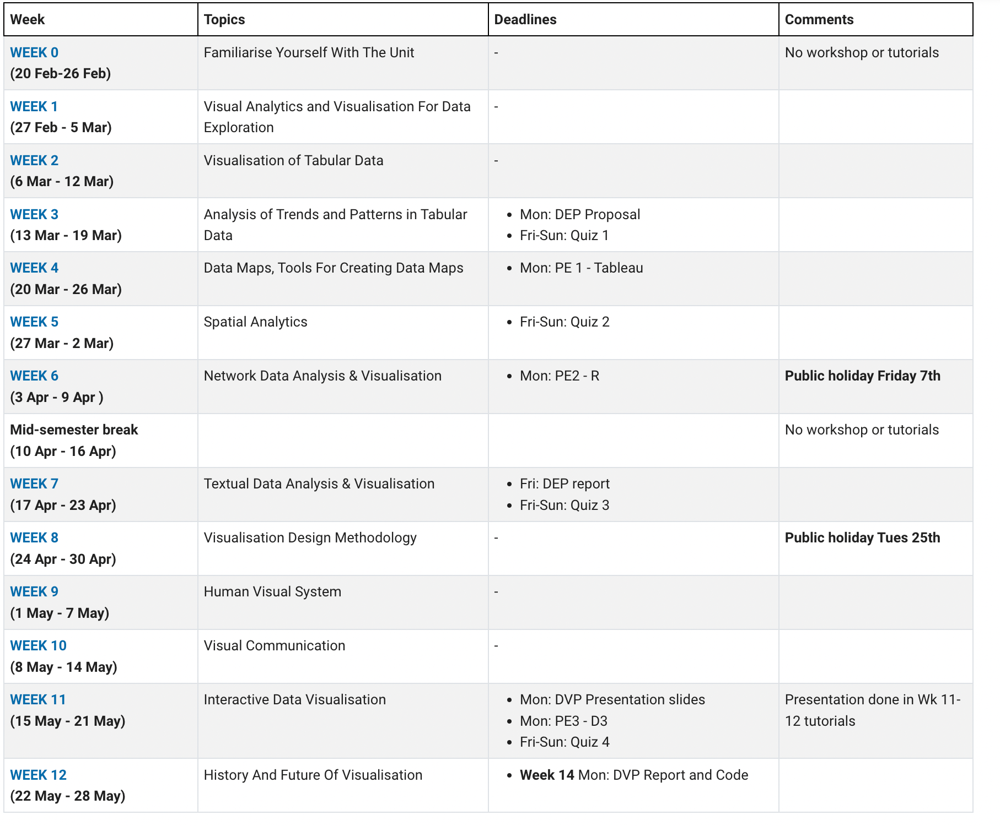
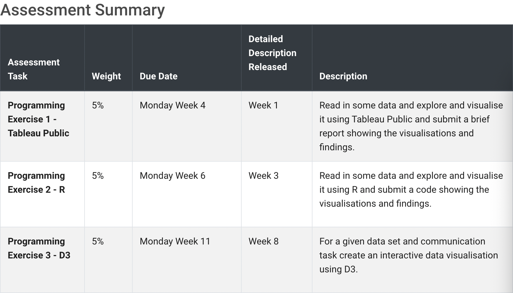
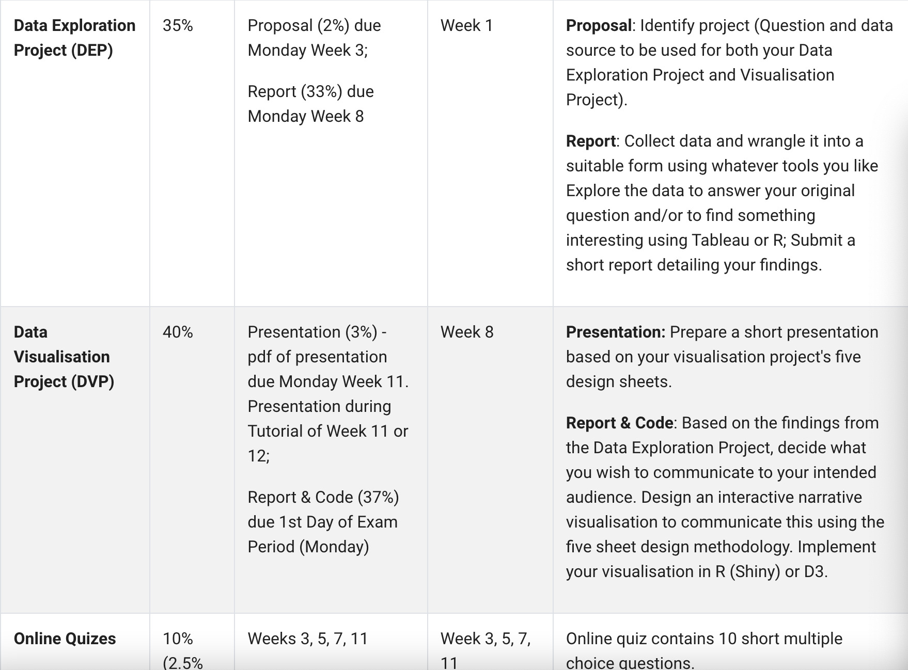
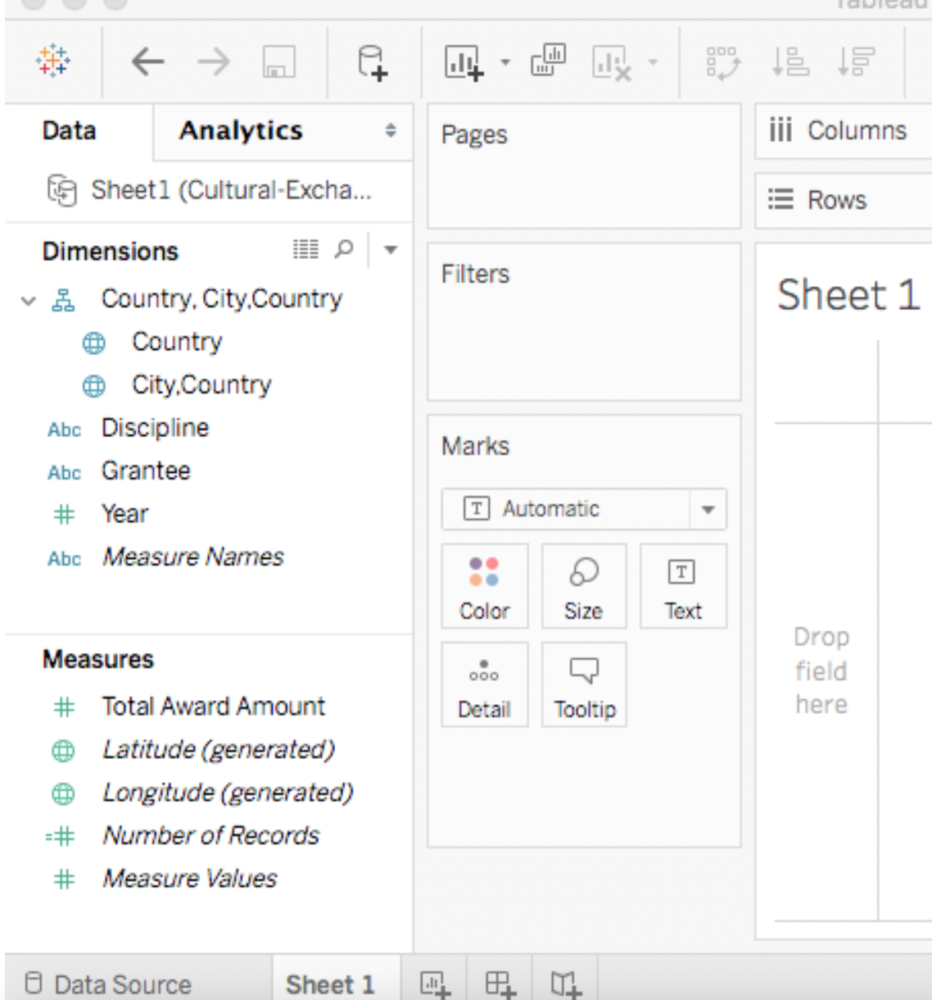
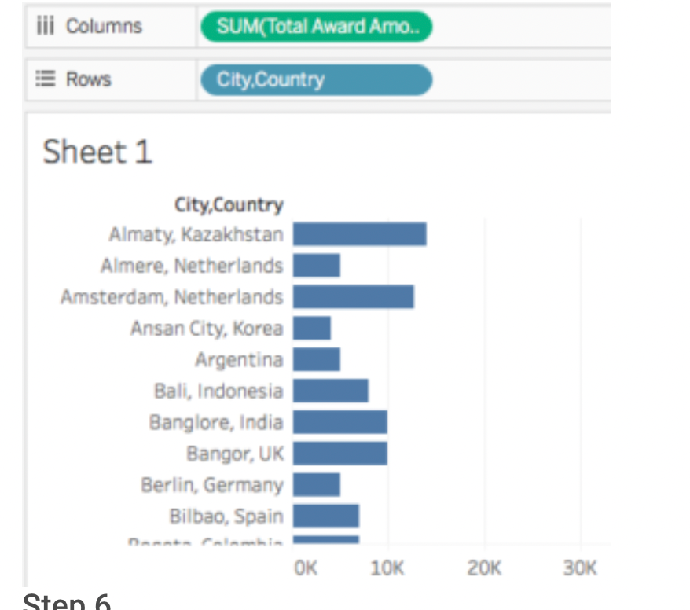

# FIT5046 Data explor and Visuali 初笔记

## Unit intro

### 1. Unit Schedule

### 2. Teaching methods

1. Workshop(2h) 
2. Tutorial(2h)

### 3. Assessment 

### 4.Learning Resources

1. Module网页自学

2. workshop ppt

3. Introduction to R - https://lms.monash.edu/course/view.php?id=34595%20

## R basic

## Week01:Intro

You should also start your data exploration project(Propose 2%)

- you should have identified **what** you want to investigate 
- **where** you are going to get your data from.

==the Role/purpose of data visualisation==作用/目的

1. 检查***Data checking and cleaning***. When you first get your data you should do some quick plots of the individual features to `check that there are no obvious errors` and to get a feel for the distribution of values.

   The following is a quick check list for each attribute:

   - Look at some random records
   - Compute the mean, median and quartiles for the data. Look at a box plot of these.
   - Determine the number of missing values and invalid values (NaNs), number of special values like 0.
   - Determine the number of distinct values and whether they really are distinct.
   - Plot the frequency distribution of values. This might be with a histogram or density plot. You should play around with the choice of bin width as this smooths the data.
   - Check for symmetry (skewness) and the flatness/spikiness of the distribution (‘kurtosis’, note platykurtic = flat distribution with low peak, leptokurtic = spikey peak around the mean).
   - Look at the outliers and check whether they should be thrown away (trimmed) rounded up or down (Winsorised). This might be done, for instance, for data outside the 5th and 95th percentiles.
   - Check formats for dates, that they are in comparable time zones.
   - Plot latitude and longitude on a map to check they are sensible.
   - Check text for strange characters or encoding

2. 发现***Exploration and discovery***.when she gets a new data set, she starts by making a dozen or more scatter plots, trying to get a sense of what might be interesting. Visualisation `reveals possible connections and patterns and trends`that can then be confirmed (or not) using other kinds of analysis. Visualisation also plays a key role in understanding any kind of spatial data.

   Typical task during exploration are:

   - Search for elements that satisfy certain properties, if they exist. This might be locating a known data point, filtering the data, or finding outliers.
   - Identify the properties of a single data item
   - Compare or rank elements
   - Visually identify patterns in some subset of elements. Examples include trends, correlations, clusters or categories.
   - Calculate derived properties not originally in the data. These may be data transformations, data aggregations or may be statistical properties such as regression lines or clusters

3. 理解***Presentation and communication of results.*** This has two main purposes:

   (1) to help you and other modellers/analysts understand the results and 

   (2) to communicate the results to other stakeholders.

   不要：trying to create a cool looking InfoGraphic

   要：think about the best way to present your data and story and make sure that it communicates it effectively and does not simplify the story too much by hiding complexity.

==为什么会出现Data Visualization==

1. 科学技术的提高*Improved technology for producing and presenting graphics.* Widespread use of information graphics could not have happened without paper and printing and interactive data visualisation was impossible without the computer.
2. 社会需求*Changes in societal needs and attitudes to graphics.* The Scientific Revolution required scientific and medical illustrations, the Age of Exploration needed maps, the Industrial Revolution required engineering drawings and the 21st century requires interactive data visualisations.
3. 数据的可用性应用*Availability of data.* Detailed maps require accurate surveys while graphs showing population or wealth distribution require census data.
4. 图形符号和交互技术的发明*Invention of graphical notations and interaction techniques.* These allow the data to be shown in ways that are useful, that answer society’s needs. They form a visual language.

==Tools for Data Exploration and Visualisation==

`Visual analytics` is the  the combination of interactive visualisation with statistics, data mining and other kinds of analytics.

Aim is to "detect the expected and discover the unexpected**.**

`language`

1.**R**.One of the best of the graphics libraries is **ggplot2** by Hadley Wickham.

2.**Python**. This is a nicer language but does not have quite the choice of analysis packages. It is ideal for data wrangling and Python is often used for scrapping and fusing data, then R for exploration and visualisation.

3.JS D3 creating interactive presentation graphics for the web

`visual analytics and Visualization tools`

**Tableau**:  commonly used by business intelligence for interactive exploration of tabular data

Open Tableau Public (TP), there are two ways to load the data:

- at the left top click **“Excel”** and navigate to the file you just downloaded.
- Just drag your file and drop it into Tableau Public window.

Click "Sheet 1" Shown on the left, data has been split into

- **Dimensions;** by default, Tableau treats any field containing qualitative, categorical information as a dimension;
- **Measures;** and any field containing numeric (quantitative) information as a measure.

> For our first visualisation, we will create a simple horizontal bar graph measuring City/Country against the Total Award Amounts granted to the artists from said locations.

- Drag ‘City,Country’ from **Dimensions** and drop it to **Rows**
- Drag ‘Total Award Amount’ from **Measures** and drop it to **Columns**
- Maybe also try to switch Rows and Columns

## Week02

## Week03

## Week04

## Week05

## Week06

## Week07

## Week08

## Week09

## Week10

## Week11

## Week12

## Assessment

