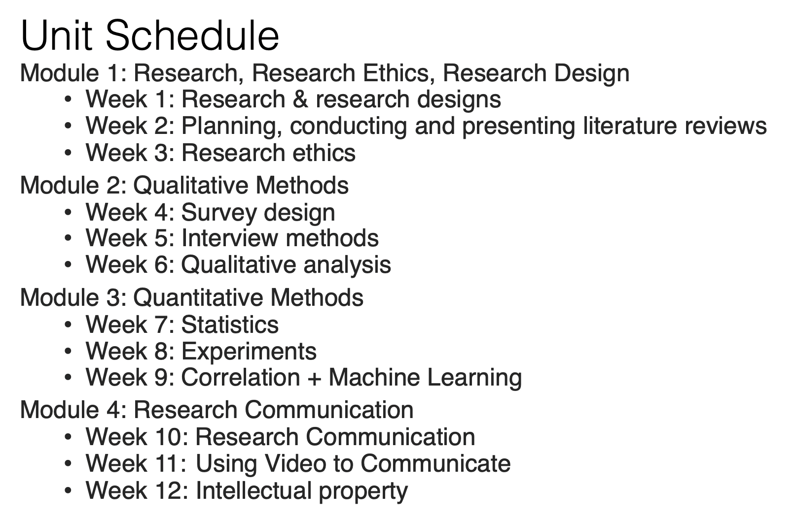
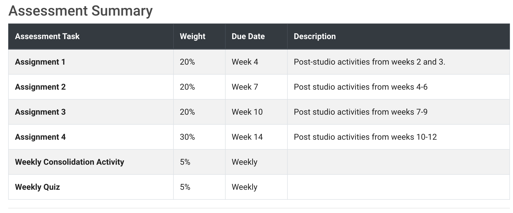
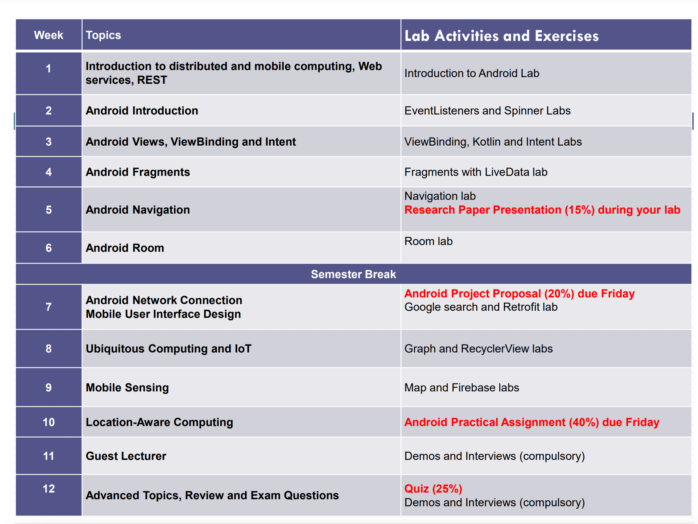
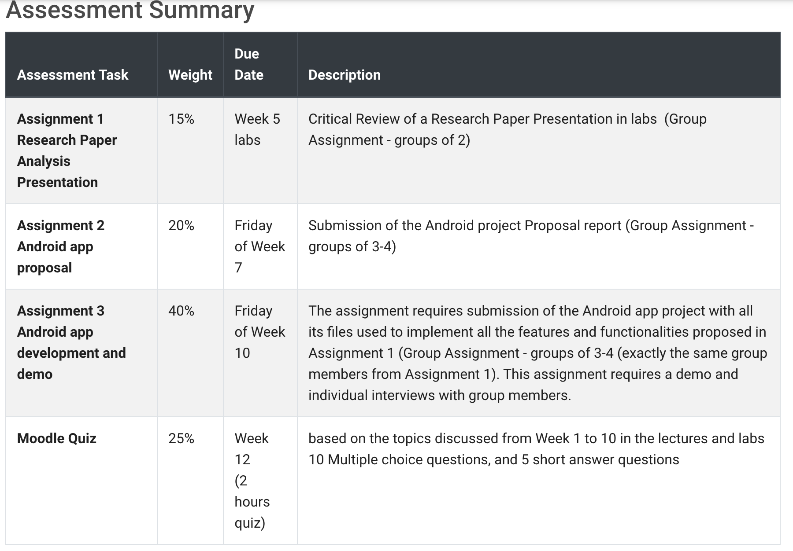
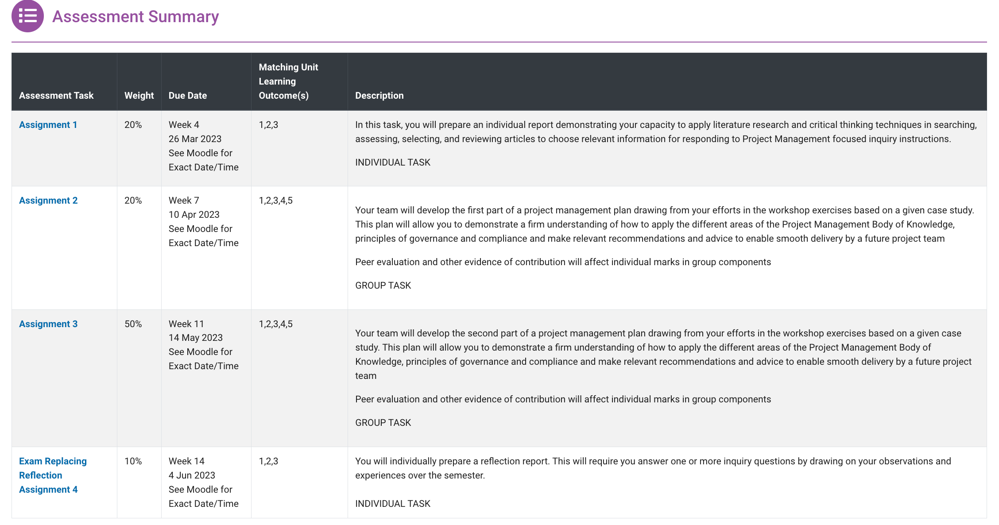
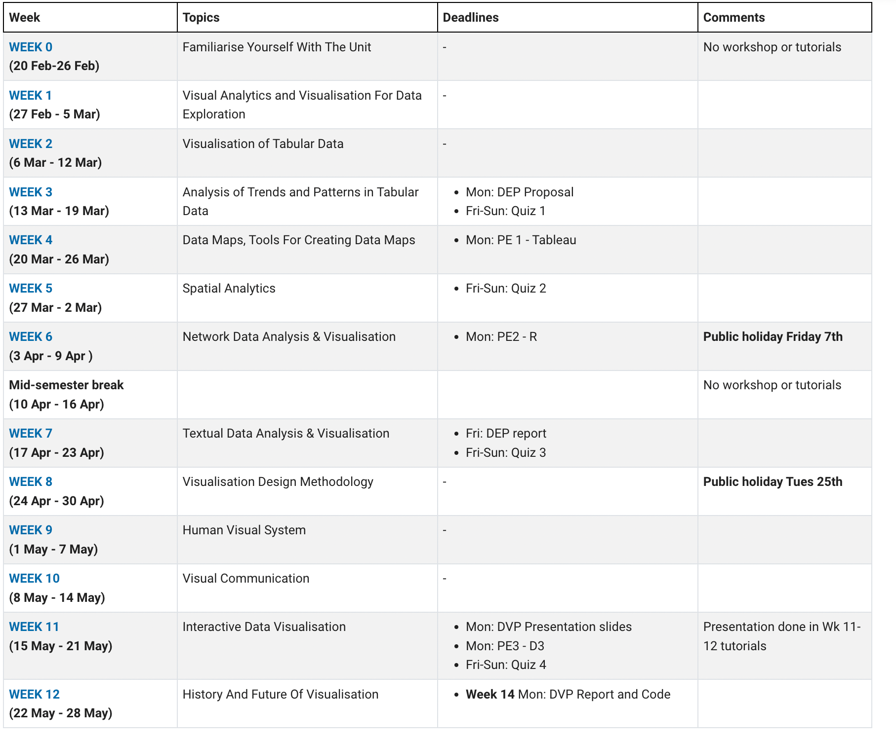
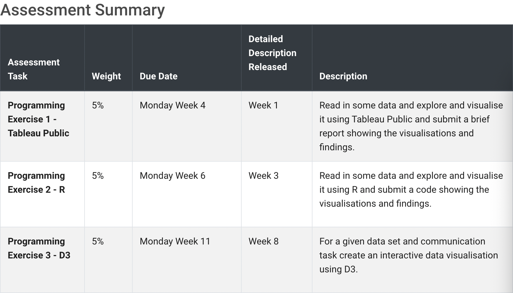
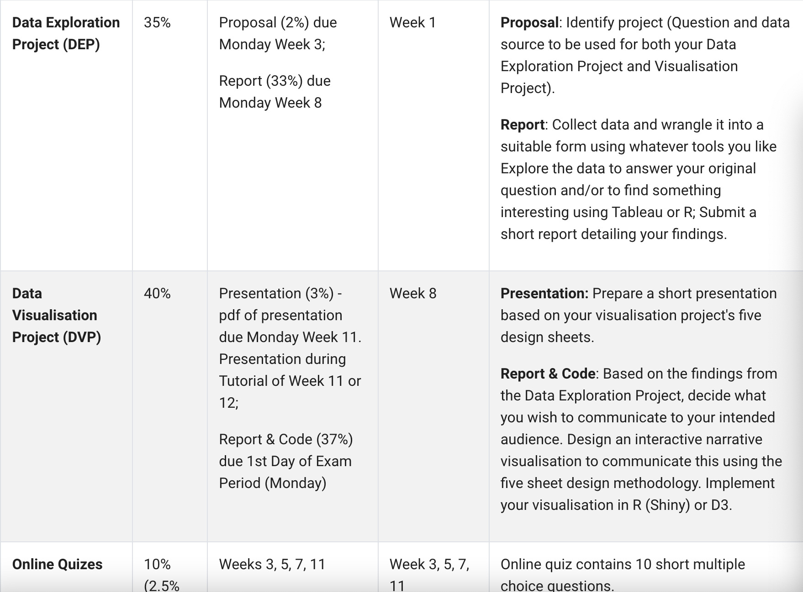

# Monash MIT 2023 S1 Units介绍

## 1.FIT5125 IT research method

### 1.1 Unit schedule

### 1.2 Teaching methods

1. Lecture(1h)：自己提前看，还有1h zoom 答疑
2. Studio(2h)：大课，3 groups，30-60人/group with 2-4 tutors
3. 4个Assignment

### 1.3 Assessment

Submission format：`PDF`

## 2.FIT5046 安卓开发

### 2.1 Unit schedule

### 2.2 Teaching methods

1. Lecture(2h) 
2. Lab(2h)

### 2.3 Assessment

## 3.FIT5057 PM

### 3.2 Teaching methods

1. Workshop(2h) 
2. Applied(2h)

### 3.3 Assessment 

## 4.FIT5147 visualisation

### 4.1 Unit Schedule

### 4.2 Teaching methods

1. Workshop(2h) 
2. Tutorial(2h)

### 4.3 Assessment 

